<!DOCTYPE html>
<html lang="ja">
<head>
  <meta charset="utf-8">
  <meta name="description" content="note">
  <meta name="author" content="online-simulator.github.io">
  <link rel="stylesheet" type="text/css" href="css/common.css">
  <link rel="stylesheet" type="text/css" href="css/color.css">
  <link rel="stylesheet" type="text/css" href="css/size.css">
<body>
<table>
<caption>2025年 支[柱]　[摘]芯　土[起]こし　土[寄]せ　除[草]</caption>
<thead>
  <tr>
    <th>品種</th>
    <th>写真</th>
    <th>区画</th>
    <th>種苗</th>
    <th>個*条*畝数</th>
    <th>備考</th>
    <th colspan="3">01月</th>
    <th colspan="3">02月</th>
    <th colspan="3">03月</th>
    <th colspan="3">04月</th>
    <th colspan="3">05月</th>
    <th colspan="3">06月</th>
    <th colspan="3">07月</th>
    <th colspan="3">08月</th>
    <th colspan="3">09月</th>
    <th colspan="3">10月</th>
    <th colspan="3">11月</th>
    <th colspan="3">12月</th>
  </tr>
  <tr>
    <th></th>
    <th>錦鯉？</th>
    <th></th>
    <th></th>
    <th></th>
    <th></th>
    <td>　</td><td>　</td><td>　</td>
      <td>　</td><td>　</td><td>　</td>
        <td>　</td><td>　</td><td>　</td>
          <td>　</td><td>　</td><td>　</td>
            <td>　</td><td>　</td><td>　</td>
              <td>　</td><td>　</td><td>　</td>
    <td>　</td><td>セミ 子蛙</td><td>閃光@03:06  子蛙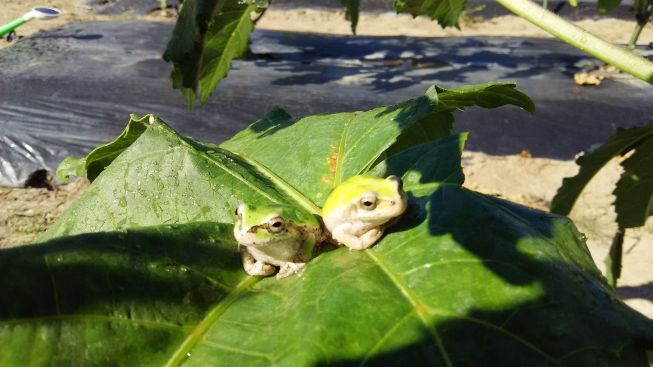 蜂 バッタ カマキリ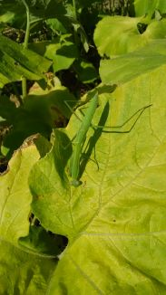</td>
      <td>子蛙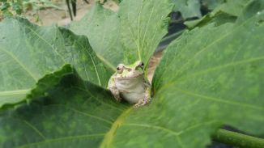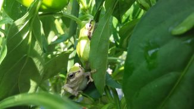 大雨一過 セミ バッタ コオロギ 蟻</td>
      <td>東の月雲 子蛙 セミ バッタ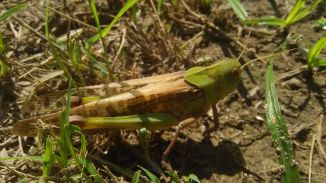 コオロギ トンボ トカゲ ミミズ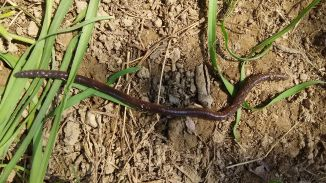 蟻</td>
      <td>蛙雨一過 蜂 ハエ カタツムリ バッタ カマキリ トンボ 蝶</td>
        <td>　</td><td>　</td><td>　</td>
          <td>　</td><td>　</td><td>　</td>
            <td>　</td><td>　</td><td>　</td>
              <td>　</td><td>　</td><td>　</td>
  </tr>
  <tr>
    <th></th>
    <th></th>
    <th></th>
    <th></th>
    <th></th>
    <th>クリーナ交[換] 泥詰まり[除]去</th>
    <td>　</td><td>　</td><td>　</td>
      <td>　</td><td>　</td><td>　</td>
        <td>　</td><td>　</td><td>　</td>
          <td>　</td><td>　</td><td>　</td>
            <td>　</td><td>　</td><td>換 除</td>
              <td>　</td><td>　</td><td>　</td>
    <td>　</td><td>　</td><td>　</td>
      <td>　</td><td>　</td><td>　</td>
        <td>　</td><td>　</td><td>　</td>
          <td>　</td><td>　</td><td>　</td>
            <td>　</td><td>　</td><td>　</td>
              <td>　</td><td>　</td><td>　</td>
  </tr>
  <tr>
    <th></th>
    <th></th>
    <th></th>
    <th></th>
    <th></th>
    <th>水道 [修]理 交[換]</th>
    <td>　</td><td>　</td><td>　</td>
      <td>　</td><td>　</td><td>　</td>
        <td>換</td><td>　</td><td>　</td>
          <td>　</td><td>　</td><td>　</td>
            <td>　</td><td>　</td><td>　</td>
              <td>　</td><td>　</td><td>　</td>
    <td>　</td><td>　</td><td>　</td>
      <td>古巣の洗浄@西玄関前</td><td>　</td><td>　</td>
        <td>　</td><td>　</td><td>　</td>
          <td>　</td><td>　</td><td>　</td>
            <td>　</td><td>　</td><td>　</td>
              <td>　</td><td>　</td><td>　</td>
  </tr>
  <tr>
    <th></th>
    <th></th>
    <th></th>
    <th></th>
    <th></th>
    <th>畦道 補[修] 補[充]</th>
    <td>　</td><td>　</td><td>　</td>
      <td>　</td><td>　</td><td>　</td>
        <td>　</td><td>　</td><td>　</td>
          <td>　</td><td>　</td><td>　</td>
            <td>　</td><td>　</td><td>　</td>
              <td>修</td><td>修2</td><td>　</td>
    <td>　</td><td>草</td><td>充2</td>
      <td>街道通行止め@16時頃</td><td>草3</td><td>　</td>
        <td>　</td><td>　</td><td>　</td>
          <td>　</td><td>　</td><td>　</td>
            <td>　</td><td>　</td><td>　</td>
              <td>　</td><td>　</td><td>　</td>
  </tr>
</thead>
<tbody>
  <tr>
    <th>ブルーベリー</th>
    <th></th>
    <th></th>
    <th></th>
    <th>1</th>
    <th>北側の木は鳥たち（スズメも）が実を食べた</th>
    <td>　</td><td>　</td><td>　</td>
      <td>　</td><td>　</td><td>　</td>
        <td>　</td><td>　</td><td>　</td>
          <td>　</td><td>　</td><td>　</td>
            <td>　</td><td>　</td><td>　</td>
              <td>　</td><td>　</td><td>　</td>
    <td>　</td><td>網</td><td>　</td>
      <td>　</td><td>　</td><td>　</td>
        <td>　</td><td>　</td><td>　</td>
          <td>　</td><td>　</td><td>　</td>
            <td>　</td><td>　</td><td>　</td>
              <td>　</td><td>　</td><td>　</td>
  </tr>
  <tr>
    <th>金柑</th>
    <th></th>
    <th>NE</th>
    <th></th>
    <th>1</th>
    <th>半数の実が凍結で白く変色（近辺一帯）</th>
    <td>　</td><td>　</td><td>　</td>
      <td>　</td><td>　</td><td>　</td>
        <td>　</td><td>　</td><td>　</td>
          <td>　</td><td>　</td><td>　</td>
            <td>　</td><td>■</td><td>　</td>
              <td>　</td><td>　</td><td>　</td>
    <td>　</td><td>　</td><td>　</td>
      <td>　</td><td>　</td><td>　</td>
        <td>　</td><td>　</td><td>　</td>
          <td>　</td><td>　</td><td>　</td>
            <td>　</td><td>　</td><td>　</td>
              <td>　</td><td>　</td><td>　</td>
  </tr>
  <tr>
    <th>みかん</th>
    <th></th>
    <th>SW</th>
    <th></th>
    <th>1+1</th>
    <th></th>
    <td>　</td><td>　</td><td>　</td>
      <td>　</td><td>　</td><td>　</td>
        <td>　</td><td>　</td><td>　</td>
          <td>　</td><td>　</td><td>　</td>
            <td>　</td><td>土</td><td>　</td>
              <td>　</td><td>　</td><td>　</td>
    <td>　</td><td>　</td><td>　</td>
      <td>　</td><td>　</td><td></td>
        <td>　</td><td>　</td><td>　</td>
          <td>　</td><td>　</td><td>　</td>
            <td>　</td><td>　</td><td>　</td>
              <td>　</td><td>　</td><td>　</td>
  </tr>
  <tr>
    <th>柿</th>
    <th></th>
    <th>E</th>
    <th></th>
    <th>2+2+1</th>
    <th>甘柿接ぎ木</th>
    <td>　</td><td>　</td><td>　</td>
      <td>　</td><td>　</td><td>　</td>
        <td>　</td><td>　</td><td>　</td>
          <td>　</td><td>　</td><td>　</td>
            <td>　</td><td>　</td><td>　</td>
              <td>　</td><td>　</td><td>　</td>
    <td>　</td><td>　</td><td>　</td>
      <td>　</td><td>　</td><td>　</td>
        <td>　</td><td>　</td><td>　</td>
          <td>　</td><td>　</td><td>　</td>
            <td>　</td><td>　</td><td>　</td>
              <td>　</td><td>　</td><td>　</td>
  </tr>
  <tr>
    <th>菊</th>
    <th></th>
    <th>SE</th>
    <th>株</th>
    <th>14*1*1</th>
    <th></th>
    <td>　</td><td>　</td><td>　</td>
      <td>　</td><td>　</td><td>　</td>
        <td>供</td><td>　</td><td>　</td>
          <td>　</td><td>　</td><td>　</td>
            <td>供</td><td>　</td><td>　</td>
              <td>　</td><td>　</td><td>供</td>
    <td>　</td><td>供</td><td>　</td>
      <td>　</td><td>供</td><td>　</td>
        <td>　</td><td>　</td><td>　</td>
          <td>　</td><td>　</td><td>　</td>
            <td>　</td><td>　</td><td>　</td>
              <td>　</td><td>　</td><td>　</td>
  </tr>
  <tr>
    <th>ネギ</th>
    <th></th>
    <th>SC</th>
    <th>株</th>
    <th>30*3*1 15*3*1</th>
    <th></th>
    <td>　</td><td>　</td><td>　</td>
      <td>　</td><td>　</td><td>　</td>
        <td>　</td><td>　</td><td>　</td>
          <td>　</td><td>葉</td><td>　</td>
            <td>　</td><td>　</td><td>　</td>
              <td>　</td><td>　</td><td>　</td>
    <td>　</td><td>　</td><td>草</td>
      <td>　</td><td>草2 ■2</td><td>■ ■</td>
        <td>　</td><td>　</td><td>　</td>
          <td>　</td><td>　</td><td>　</td>
            <td>　</td><td>　</td><td>　</td>
              <td>　</td><td>　</td><td>　</td>
  </tr>
  <tr>
    <th>トマト</th>
    <th>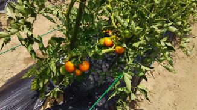</th>
    <th>NW</th>
    <th>苗</th>
    <th>10*1*1</th>
    <th>大玉の半数は日焼け 日差しの要対策（根の地温＜３０℃） 花と実が少ない（森苗なし）</th>
    <td>　</td><td>　</td><td>　</td>
      <td>　</td><td>　</td><td>　</td>
        <td>　</td><td>　</td><td>　</td>
          <td>　</td><td>　</td><td>　</td>
            <td>　</td><td>　</td><td>植 柱</td>
              <td>　</td><td>芽</td><td>■3</td>
    <td>■7</td><td>■11</td><td>■ 枝 芽2 ■3 肥 ■7</td>
      <td>■2  ■7 枝 ■</td><td>■2 枝 肥 □ □3 ■ □ □ □</td><td>□ 受 □ □ 受 □ □ □ 枝の水栽培 □2</td>
        <td>　</td><td>　</td><td>　</td>
          <td>　</td><td>　</td><td>　</td>
            <td>　</td><td>　</td><td>　</td>
              <td>　</td><td>　</td><td>　</td>
  </tr>
  <tr>
    <th>トマト</th>
    <th></th>
    <th>SW</th>
    <th>苗</th>
    <th>(3+4)*1*1</th>
    <th>支柱の色（黒焼け⇒緑）</th>
    <td>　</td><td>　</td><td>　</td>
      <td>　</td><td>　</td><td>　</td>
        <td>　</td><td>　</td><td>　</td>
          <td>　</td><td>　</td><td>　</td>
            <td>　</td><td>　</td><td>　</td>
              <td>植</td><td>　</td><td>　</td>
    <td>　</td><td>植</td><td>枝 ■ 肥 ■3</td>
      <td>■  ■5</td><td>■ 肥 □ □4</td><td>□8</td>
        <td>　</td><td>　</td><td>　</td>
          <td>　</td><td>　</td><td>　</td>
            <td>　</td><td>　</td><td>　</td>
              <td>　</td><td>　</td><td>　</td>
  </tr>
  <tr>
    <th>ナス</th>
    <th></th>
    <th>WC</th>
    <th>苗</th>
    <th>6*1*1</th>
    <th>3本仕立て </th>
    <td>　</td><td>　</td><td>　</td>
      <td>　</td><td>　</td><td>　</td>
        <td>　</td><td>　</td><td>　</td>
          <td>　</td><td>　</td><td>　</td>
            <td>　</td><td>　</td><td>植 柱</td>
              <td>　</td><td>葉</td><td>■6</td>
    <td>■6 葉 ■3</td><td>■3 起 肥 ■8</td><td>■ 葉 ■3 葉 ■ 虫 葉 ■6</td>
      <td>■2  ■6 ■2</td><td>■3 肥（境界線⇒中心線上） ■7</td><td>■8 ■2</td>
        <td>　</td><td>　</td><td>　</td>
          <td>　</td><td>　</td><td>　</td>
            <td>　</td><td>　</td><td>　</td>
              <td>　</td><td>　</td><td>　</td>
  </tr>
  <tr>
    <th>ナス</th>
    <th></th>
    <th>NW</th>
    <th>株</th>
    <th>1*1*1</th>
    <th>自然発生の苗</th>
    <td>　</td><td>　</td><td>　</td>
      <td>　</td><td>　</td><td>　</td>
        <td>　</td><td>　</td><td>　</td>
          <td>　</td><td>　</td><td>　</td>
            <td>　</td><td>　</td><td>　</td>
              <td>　</td><td>　</td><td>　</td>
    <td>耕 土2</td><td>移</td><td>　</td>
      <td>寄 ■</td><td></td><td></td>
        <td>　</td><td>　</td><td>　</td>
          <td>　</td><td>　</td><td>　</td>
            <td>　</td><td>　</td><td>　</td>
              <td>　</td><td>　</td><td>　</td>
  </tr>
  <tr>
    <th>ピーマン</th>
    <th>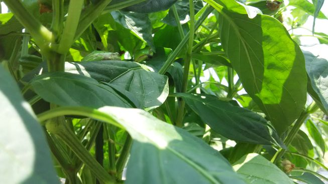</th>
    <th>WC</th>
    <th>苗</th>
    <th>4*1*1</th>
    <th>水やりに蜂</th>
    <td>　</td><td>　</td><td>　</td>
      <td>　</td><td>　</td><td>　</td>
        <td>　</td><td>　</td><td>　</td>
          <td>　</td><td>　</td><td>　</td>
            <td>　</td><td>　</td><td>植 柱</td>
              <td>　</td><td>　</td><td>■3</td>
    <td>■2 蛙6 ■7</td><td>■11</td><td>■11</td>
      <td>■2  ■8</td><td>■10</td><td>■ </td>
        <td>　</td><td>　</td><td>　</td>
          <td>　</td><td>　</td><td>　</td>
            <td>　</td><td>　</td><td>　</td>
              <td>　</td><td>　</td><td>　</td>
  </tr>
  <tr>
    <th>オクラ</th>
    <th></th>
    <th>WC</th>
    <th>苗</th>
    <th>9*1*2 5*1*1</th>
    <th></th>
    <td>　</td><td>　</td><td>　</td>
      <td>　</td><td>　</td><td>　</td>
        <td>　</td><td>　</td><td>　</td>
          <td>　</td><td>　</td><td>　</td>
            <td>　</td><td>　</td><td>植 柱</td>
              <td>虫</td><td>　</td><td>■5</td>
    <td>■5 葉 ■4</td><td>■11</td><td>■11</td>
      <td>■2  ■4 一部で2段以上 ■ ■3</td><td>■4 新葉 ■ ■ 初 ■4</td><td>■ 1.5m ■7 ■ ■</td>
        <td>　</td><td>　</td><td>　</td>
          <td>　</td><td>　</td><td>　</td>
            <td>　</td><td>　</td><td>　</td>
              <td>　</td><td>　</td><td>　</td>
  </tr>
  <tr>
    <th>きゅうり</th>
    <th></th>
    <th>SW</th>
    <th>苗</th>
    <th>4*1*1</th>
    <th>数本枝残し 茎と葉を浮かす</th>
    <td>　</td><td>　</td><td>　</td>
      <td>　</td><td>　</td><td>　</td>
        <td>　</td><td>　</td><td>　</td>
          <td>　</td><td>　</td><td>　</td>
            <td>　</td><td>　</td><td>植</td>
              <td>　</td><td>　</td><td>■3</td>
    <td>■9</td><td>■11</td><td>枝 ■ □ ■3 肥 ■7</td>
      <td>■2 虫 ■2 ■6 雨中</td><td>■ ■ ■5 ■3</td><td>■3 窮屈な根元 ■ ■ 虫 ■4 □</td>
        <td>　</td><td>　</td><td>　</td>
          <td>　</td><td>　</td><td>　</td>
            <td>　</td><td>　</td><td>　</td>
              <td>　</td><td>　</td><td>　</td>
  </tr>
  <tr>
    <th><del>ほうれん草</del></th>
    <th></th>
    <th>SW</th>
    <th>条</th>
    <th>50*2*1</th>
    <th></th>
    <td>　</td><td>　</td><td>　</td>
      <td>　</td><td>　</td><td>　</td>
        <td>　</td><td>　</td><td>　</td>
          <td>　</td><td>　</td><td>　</td>
            <td>　</td><td>　</td><td>種</td>
              <td>○</td><td>　</td><td>　</td>
    <td>　</td><td>　</td><td>□</td>
      <td>　</td><td>　</td><td>　</td>
        <td>　</td><td>　</td><td>　</td>
          <td>　</td><td>　</td><td>　</td>
            <td>　</td><td>　</td><td>　</td>
              <td>　</td><td>　</td><td>　</td>
  </tr>
  <tr>
    <th><del>チンゲン菜</del></th>
    <th></th>
    <th>SW</th>
    <th>条</th>
    <th>50*3*1</th>
    <th></th>
    <td>　</td><td>　</td><td>　</td>
      <td>　</td><td>　</td><td>　</td>
        <td>　</td><td>　</td><td>　</td>
          <td>　</td><td>　</td><td>　</td>
            <td>　</td><td>　</td><td>種</td>
              <td>○</td><td>虫</td><td>　</td>
    <td>　</td><td>　</td><td>□</td>
      <td>　</td><td>　</td><td>　</td>
        <td>　</td><td>　</td><td>　</td>
          <td>　</td><td>　</td><td>　</td>
            <td>　</td><td>　</td><td>　</td>
              <td>　</td><td>　</td><td>　</td>
  </tr>
  <tr>
    <th><del>インゲン豆</del></th>
    <th>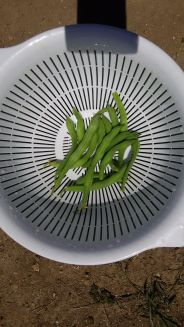</th>
    <th>SW</th>
    <th>株</th>
    <th>(2*5)*2*1</th>
    <th>粒が不揃い</th>
    <td>　</td><td>　</td><td>　</td>
      <td>　</td><td>　</td><td>　</td>
        <td>　</td><td>　</td><td>　</td>
          <td>　</td><td>　</td><td>　</td>
            <td>　</td><td>　</td><td>　</td>
              <td>土</td><td>植</td><td>　</td>
    <td>　</td><td>■3</td><td>■3</td>
      <td>□</td><td>回</td><td>　</td>
        <td>　</td><td>　</td><td>　</td>
          <td>　</td><td>　</td><td>　</td>
            <td>　</td><td>　</td><td>　</td>
              <td>　</td><td>　</td><td>　</td>
  </tr>
  <tr>
    <th><del>コーン</del></th>
    <th></th>
    <th>SW</th>
    <th>株</th>
    <th><del>8*2*1</del> (14+1)*3*1</th>
    <th>粒数＝絹糸数 植の時期と場所を考える</th>
    <td>　</td><td>　</td><td>　</td>
      <td>　</td><td>　</td><td>　</td>
        <td>　</td><td>　</td><td>　</td>
          <td>　</td><td>　</td><td>　</td>
            <td>　</td><td>　</td><td>　</td>
              <td>土</td><td>植2</td><td>　</td>
    <td>植 肥</td><td>寄</td><td>鳥の爪？で折れた３本の内１本消失 □ 狸？が5-1=4本を近場に運んで食べた残1残2 ■</td>
      <td>畔道を越えて4本回収 ■  昼間の蟻？ ■ 小蟻 近場に残4本 真横に残5本以上 残部僅少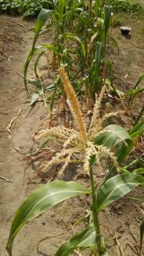 □</td><td>　</td><td>　</td>
        <td>　</td><td>　</td><td>　</td>
          <td>　</td><td>　</td><td>　</td>
            <td>　</td><td>　</td><td>　</td>
              <td>　</td><td>　</td><td>　</td>
  </tr>
  <tr>
    <th>スイカ</th>
    <th></th>
    <th>CC</th>
    <th>株</th>
    <th>3*1*1</th>
    <th>枝を5本残す 摘芯ミスに注意 訪花昆虫と蟻が少ない 朝方の雌花に受粉</th>
    <td>　</td><td>　</td><td>　</td>
      <td>　</td><td>　</td><td>　</td>
        <td>　</td><td>　</td><td>　</td>
          <td>　</td><td>　</td><td>　</td>
            <td>　</td><td>　</td><td>植 柱</td>
              <td>　</td><td>摘 枝</td><td>受2</td>
    <td>藁</td><td>　</td><td>■2</td>
      <td> ■ </td><td>甘め</td><td></td>
        <td>　</td><td>　</td><td>　</td>
          <td>　</td><td>　</td><td>　</td>
            <td>　</td><td>　</td><td>　</td>
              <td>　</td><td>　</td><td>　</td>
  </tr>
  <tr>
    <th>カボチャ</th>
    <th></th>
    <th>SC</th>
    <th>苗</th>
    <th>3*2*1</th>
    <th></th>
    <td>　</td><td>　</td><td>　</td>
      <td>　</td><td>　</td><td>　</td>
        <td>　</td><td>　</td><td>　</td>
          <td>　</td><td>　</td><td>　</td>
            <td>　</td><td>　</td><td>植 柱</td>
              <td>　</td><td>　</td><td>受</td>
    <td>藁</td><td>　</td><td>摘 受2</td>
      <td></td><td>訪花  ■</td><td>右上コルク化</td>
        <td>　</td><td>　</td><td>　</td>
          <td>　</td><td>　</td><td>　</td>
            <td>　</td><td>　</td><td>　</td>
              <td>　</td><td>　</td><td>　</td>
  </tr>
  <tr>
    <th></th>
    <th></th>
    <th>NE</th>
    <th></th>
    <th></th>
    <th></th>
    <td>　</td><td>　</td><td>　</td>
      <td>　</td><td>　</td><td>　</td>
        <td>　</td><td>　</td><td>　</td>
          <td>　</td><td>　</td><td>　</td>
            <td>　</td><td>　</td><td>　</td>
              <td>　</td><td>　</td><td>　</td>
    <td>土 耕</td><td>　</td><td>　</td>
      <td>　</td><td>草 灰 耕 肥</td><td>耕</td>
        <td>　</td><td>　</td><td>　</td>
          <td>　</td><td>　</td><td>　</td>
            <td>　</td><td>　</td><td>　</td>
              <td>　</td><td>　</td><td>　</td>
  </tr>
  <tr>
    <th></th>
    <th></th>
    <th>SW</th>
    <th></th>
    <th></th>
    <th>コーンの後</th>
    <td>　</td><td>　</td><td>　</td>
      <td>　</td><td>　</td><td>　</td>
        <td>　</td><td>　</td><td>　</td>
          <td>　</td><td>　</td><td>　</td>
            <td>　</td><td>　</td><td>　</td>
              <td>　</td><td>　</td><td>　</td>
    <td>　</td><td>　</td><td>　</td>
      <td>　</td><td>　</td><td>耕</td>
        <td>　</td><td>　</td><td>　</td>
          <td>　</td><td>　</td><td>　</td>
            <td>　</td><td>　</td><td>　</td>
              <td>　</td><td>　</td><td>　</td>
  </tr>
  <tr>
    <th>カボチャ</th>
    <th></th>
    <th>NW</th>
    <th>株</th>
    <th>1*1*1</th>
    <th></th>
    <td>　</td><td>　</td><td>　</td>
      <td>　</td><td>　</td><td>　</td>
        <td>　</td><td>　</td><td>　</td>
          <td>　</td><td>　</td><td>　</td>
            <td>　</td><td>　</td><td>　</td>
              <td>　</td><td>　</td><td>　</td>
    <td>耕 土2</td><td>植 虫</td><td>寄</td>
      <td>寄 蔓</td><td>直土の葉</td><td>　</td>
        <td>　</td><td>　</td><td>　</td>
          <td>　</td><td>　</td><td>　</td>
            <td>　</td><td>　</td><td>　</td>
              <td>　</td><td>　</td><td>　</td>
  </tr>
  <tr>
    <th><del>人参</del></th>
    <th></th>
    <th>NC</th>
    <th>条</th>
    <th>50*2*1 100*2*1</th>
    <th></th>
    <td>　</td><td>　</td><td>　</td>
      <td>　</td><td>　</td><td>　</td>
        <td>　</td><td>　</td><td>　</td>
          <td>　</td><td>　</td><td>　</td>
            <td>　</td><td>■</td><td>　</td>
              <td>　</td><td>　</td><td>　</td>
    <td>　</td><td>　</td><td>　</td>
      <td>　</td><td>　</td><td>　</td>
        <td>　</td><td>　</td><td>　</td>
          <td>　</td><td>　</td><td>　</td>
            <td>　</td><td>　</td><td>　</td>
              <td>　</td><td>　</td><td>　</td>
  </tr>
  <tr>
    <th><del>ニンニク</del></th>
    <th></th>
    <th>NW</th>
    <th>株</th>
    <th>15*2*0.7</th>
    <th></th>
    <td>　</td><td>　</td><td>　</td>
      <td>　</td><td>　</td><td>　</td>
        <td>　</td><td>　</td><td>　</td>
          <td>　</td><td>　</td><td>　</td>
            <td>　</td><td>　</td><td>　</td>
              <td>　</td><td>■ 乾</td><td>　</td>
    <td>　</td><td>　</td><td>　</td>
      <td>　</td><td>　</td><td>　</td>
        <td>　</td><td>　</td><td>　</td>
          <td>　</td><td>　</td><td>　</td>
            <td>　</td><td>　</td><td>　</td>
              <td>　</td><td>　</td><td>　</td>
  </tr>
  <tr>
    <th><del>玉葱</del></th>
    <th></th>
    <th>CC</th>
    <th>苗</th>
    <th>26*2*4</th>
    <th>3+3の結束で保存</th>
    <td>　</td><td>　</td><td>　</td>
      <td>　</td><td>　</td><td>　</td>
        <td>　</td><td>　</td><td>　</td>
          <td>　</td><td>　</td><td>　</td>
            <td>　</td><td>　</td><td>■ 乾</td>
              <td>　</td><td>　</td><td>　</td>
    <td>　</td><td>　</td><td>　</td>
      <td>　</td><td>雨の加湿あり</td><td>一部劣化</td>
        <td>　</td><td>　</td><td>　</td>
          <td>　</td><td>　</td><td>　</td>
            <td>　</td><td>　</td><td>　</td>
              <td>　</td><td>　</td><td>　</td>
  </tr>
  <tr>
    <th>サツマイモ</th>
    <th></th>
    <th>CC</th>
    <th>苗</th>
    <th>6*2*3</th>
    <th></th>
    <td>　</td><td>　</td><td>　</td>
      <td>　</td><td>　</td><td>　</td>
        <td>　</td><td>　</td><td>　</td>
          <td>　</td><td>　</td><td>　</td>
            <td>　</td><td>　</td><td>　</td>
              <td>耕2 植</td><td>　</td><td>　</td>
    <td>　</td><td>　</td><td>　</td>
      <td></td><td>　</td><td>　</td>
        <td>　</td><td>　</td><td>　</td>
          <td>　</td><td>　</td><td>　</td>
            <td>　</td><td>　</td><td>　</td>
              <td>　</td><td>　</td><td>　</td>
  </tr>
  <tr>
    <th>サツマイモ</th>
    <th></th>
    <th>SE</th>
    <th>苗</th>
    <th>6*1*2</th>
    <th></th>
    <td>　</td><td>　</td><td>　</td>
      <td>　</td><td>　</td><td>　</td>
        <td>　</td><td>　</td><td>　</td>
          <td>　</td><td>　</td><td>　</td>
            <td>　</td><td>　</td><td>　</td>
              <td>耕</td><td>植</td><td>　</td>
    <td>　</td><td>　</td><td>　</td>
      <td></td><td>　</td><td>　</td>
        <td>　</td><td>　</td><td>　</td>
          <td>　</td><td>　</td><td>　</td>
            <td>　</td><td>　</td><td>　</td>
              <td>　</td><td>　</td><td>　</td>
  </tr>
  <tr>
    <th>里芋</th>
    <th></th>
    <th>SE</th>
    <th>苗</th>
    <th>3*1*1</th>
    <th></th>
    <td>　</td><td>　</td><td>　</td>
      <td>　</td><td>　</td><td>　</td>
        <td>　</td><td>　</td><td>　</td>
          <td>　</td><td>　</td><td>　</td>
            <td>　</td><td>　</td><td>　</td>
              <td>耕</td><td>植</td><td>　</td>
    <td>　</td><td>　</td><td>　</td>
      <td></td><td>　</td><td>　</td>
        <td>　</td><td>　</td><td>　</td>
          <td>　</td><td>　</td><td>　</td>
            <td>　</td><td>　</td><td>　</td>
              <td>　</td><td>　</td><td>　</td>
  </tr>
</tbody>
</table>

<table>
<caption>2024年 [土]作り　[耕]うん　石[灰]　[貝]灰　培[養]土　[肥]料　[芽]かき　[葉]かき　[枝]落とし　つる[返]し　[根]出し　[種]まき　定[植]　[補]充　[移]植　[受]粉　[重]曹1/1000倍　[蛙]よく育つ　虫[除]け　[虫]食い　虫の[排]泄物　虫の[卵]　虫∩[外]出　∩トンネル　△○◎発芽　結[球]　□■収穫　[乾]燥　[試]し掘り　種[回]収</caption>
<thead>
  <tr>
    <th>品種</th>
    <th>写真</th>
    <th>区画</th>
    <th>種苗</th>
    <th>個*条*畝数</th>
    <th>備考</th>
    <th colspan="3">01月</th>
    <th colspan="3">02月</th>
    <th colspan="3">03月</th>
    <th colspan="3">04月</th>
    <th colspan="3">05月</th>
    <th colspan="3">06月</th>
    <th colspan="3">07月</th>
    <th colspan="3">08月</th>
    <th colspan="3">09月</th>
    <th colspan="3">10月</th>
    <th colspan="3">11月</th>
    <th colspan="3">12月</th>
  </tr>
  <tr>
    <th></th>
    <th></th>
    <th></th>
    <th></th>
    <th></th>
    <th>雨 午[前] 午[後] [終]日</th>
    <td>－</td><td>－</td><td>－</td>
      <td>－</td><td>－</td><td>－</td>
        <td>－</td><td>－</td><td>－</td>
          <td>－</td><td>－</td><td>－</td>
            <td>－</td><td>－</td><td>－</td>
              <td>－</td><td>－</td><td>－</td>
    <td>－</td><td>－</td><td>－</td>
      <td>　</td><td>　</td><td>終</td>
        <td>朝</td><td>夕 朝</td><td>前</td>
          <td>終 前 終2</td><td>朝 終</td><td>終 朝 夜 後</td>
            <td>終 前 夜</td><td>夕 後2</td><td>終 昼</td>
              <td>　</td><td>　</td><td>後</td>
  </tr>
  <tr>
    <th></th>
    <th></th>
    <th></th>
    <th></th>
    <th></th>
    <th>10/26~季節の急変⇒発汗量の急減少⇒水分過多⇒腰</th>
    <td>－</td><td>－</td><td>－</td>
      <td>－</td><td>－</td><td>－</td>
        <td>－</td><td>－</td><td>－</td>
          <td>－</td><td>－</td><td>－</td>
            <td>－</td><td>－</td><td>－</td>
              <td>－</td><td>－</td><td>－</td>
    <td>－</td><td>－</td><td>－</td>
      <td>－</td><td>－</td><td>－</td>
        <td>－</td><td>－</td><td>－</td>
          <td>－</td><td>－</td><td>－</td>
            <td>天</td><td>天 滝</td><td>ス 森 ハ</td>
              <td>ス 駅 ○ 紅</td><td>ハ 香 ス</td><td>　</td>
  </tr>
  <tr>
    <th></th>
    <th></th>
    <th></th>
    <th></th>
    <th></th>
    <th>水道 [修]理 交[換]</th>
    <td>　</td><td>　</td><td>　</td>
      <td>　</td><td>　</td><td>　</td>
        <td>　</td><td>　</td><td>　</td>
          <td>　</td><td>　</td><td>　</td>
            <td>　</td><td>　</td><td>　</td>
              <td>　</td><td>　</td><td>　</td>
    <td>　</td><td>　</td><td>　</td>
      <td>　</td><td>　</td><td>　</td>
        <td>修</td><td>換</td><td>　</td>
          <td>　</td><td>　</td><td>　</td>
            <td>　</td><td>　</td><td>　</td>
              <td>仮</td><td>換</td><td>　</td>
  </tr>
  <tr>
    <th></th>
    <th></th>
    <th></th>
    <th></th>
    <th></th>
    <th>畦道 補[修]</th>
    <td>　</td><td>　</td><td>　</td>
      <td>　</td><td>　</td><td>　</td>
        <td>　</td><td>　</td><td>　</td>
          <td>　</td><td>　</td><td>　</td>
            <td>　</td><td>　</td><td>　</td>
              <td>　</td><td>　</td><td>　</td>
    <td>　</td><td>　</td><td>　</td>
      <td>　</td><td>　</td><td>　</td>
        <td>　</td><td>　</td><td>　</td>
          <td>修 耕 修</td><td>　</td><td>　</td>
            <td>　</td><td>　</td><td>　</td>
              <td>　</td><td>木</td><td>　</td>
  </tr>
</thead>
<tbody>
  <tr>
    <th>金柑</th>
    <th></th>
    <th>NE</th>
    <th></th>
    <th>1</th>
    <th>水道・畦道・風通し</th>
    <td>　</td><td>　</td><td>　</td>
      <td>　</td><td>　</td><td>　</td>
        <td>　</td><td>　</td><td>■</td>
          <td>■</td><td>　</td><td>■3</td>
            <td>　</td><td>　</td><td>■</td>
              <td>　</td><td>　</td><td>　</td>
    <td>　</td><td>　</td><td>　</td>
      <td>　</td><td>　</td><td>　</td>
        <td>　</td><td>　</td><td>　</td>
          <td>　</td><td>　</td><td>　</td>
            <td>　</td><td>　</td><td>　</td>
              <td>　</td><td>　</td><td>　</td>
  </tr>
  <tr>
    <th>みかん</th>
    <th></th>
    <th>SW</th>
    <th></th>
    <th>1+1</th>
    <th>様子見</th>
    <td>　</td><td>　</td><td>　</td>
      <td>　</td><td>　</td><td>　</td>
        <td>　</td><td>　</td><td>　</td>
          <td>　</td><td>　</td><td>　</td>
            <td>　</td><td>　</td><td>　</td>
              <td>　</td><td>　</td><td>　</td>
    <td>　</td><td>　</td><td>　</td>
      <td>　</td><td>　</td><td>　</td>
        <td>■</td><td>　</td><td>■</td>
          <td>　</td><td>■2</td><td>　</td>
            <td>■</td><td>■2</td><td>■5</td>
              <td>■7</td><td>■4</td><td>■3</td>
  </tr>
  <tr>
    <th>柿</th>
    <th></th>
    <th>E</th>
    <th></th>
    <th>2+2+1</th>
    <th>甘柿接ぎ木・日当たり</th>
    <td>　</td><td>　</td><td>　</td>
      <td>　</td><td>　</td><td>　</td>
        <td>　</td><td>　</td><td>　</td>
          <td>　</td><td>芽</td><td>　</td>
            <td>　</td><td>　</td><td>　</td>
              <td>　</td><td>　</td><td>　</td>
    <td>　</td><td>　</td><td>　</td>
      <td>　</td><td>　</td><td>　</td>
        <td>　</td><td>　</td><td>　</td>
          <td>　</td><td>■8</td><td>■8</td>
            <td>■4</td><td>■6</td><td>■4</td>
              <td>■</td><td>■6</td><td>■7</td>
  </tr>
  <tr>
    <th><del>菊</del></th>
    <th></th>
    <th>EC</th>
    <th>元株</th>
    <th>5*2*1</th>
    <th>様子見 脚立</th>
    <td>　</td><td>　</td><td>　</td>
      <td>　</td><td>　</td><td>　</td>
        <td>　</td><td>　</td><td>　</td>
          <td>土</td><td>　</td><td>　</td>
            <td>　</td><td>棒</td><td>　</td>
              <td>　</td><td>　</td><td>　</td>
    <td>　</td><td>　</td><td>　</td>
      <td>　</td><td>　</td><td>　</td>
        <td>枝</td><td>　</td><td>　</td>
          <td>　</td><td>　</td><td>枝</td>
            <td>　</td><td>花</td><td>倒</td>
              <td>　</td><td>　</td><td>　</td>
  </tr>
  <tr>
    <th>菊</th>
    <th></th>
    <th>SE</th>
    <th>株</th>
    <th>14*1*1</th>
    <th>3本枝残し 台風10号</th>
    <td>　</td><td>　</td><td>　</td>
      <td>　</td><td>　</td><td>　</td>
        <td>　</td><td>　</td><td>土</td>
          <td>植</td><td>　</td><td>土</td>
            <td>　</td><td>虫 棒</td><td>　</td>
              <td>　</td><td>土</td><td>　</td>
    <td>　</td><td>　</td><td>　</td>
      <td>　</td><td>　</td><td>　</td>
        <td>倒 枝 供</td><td>供</td><td>　</td>
          <td>　</td><td>　</td><td>　</td>
            <td>枝</td><td>花 供</td><td>　</td>
              <td>　</td><td>枝</td><td>供</td>
  </tr>
  <tr>
    <th>ネギ</th>
    <th>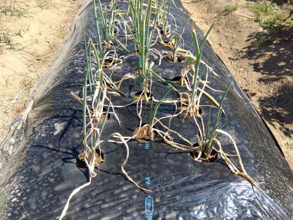</th>
    <th><del>SE</del> SC</th>
    <th>株</th>
    <th>10*1*3 30*3*1</th>
    <th>土と一緒に移植 鎮圧不足で水やりすぎ＋雨 根つかずで10本補充 鎮圧と土寄せのやり直し</th>
    <td>土</td><td>植</td><td>　</td>
      <td>　</td><td>　</td><td>　</td>
        <td>　</td><td>　</td><td>■</td>
          <td>■</td><td>土</td><td>　</td>
            <td>芽</td><td>薹 ■</td><td>■</td>
              <td>　</td><td>土2</td><td>■ 土2</td>
    <td>　</td><td>■ 芽</td><td>　</td>
      <td>　</td><td>　</td><td>土</td>
        <td>移</td><td>　</td><td>　</td>
          <td>■ 補</td><td>■</td><td>■6</td>
            <td>■3</td><td>■3</td><td>■4</td>
              <td>■6</td><td>■8</td><td>■3</td>
  </tr>
  <tr>
    <th>ネギ</th>
    <th></th>
    <th>SC</th>
    <th></th>
    <th>10*2*1 15*3*1</th>
    <th>連作の合間用 隣の畝に株分け移植 鎮圧後に土寄せ</th>
    <td>　</td><td>　</td><td>　</td>
      <td>　</td><td>　</td><td>　</td>
        <td>　</td><td>　</td><td>■</td>
          <td>■</td><td>■</td><td>　</td>
            <td>芽</td><td>薹</td><td>　</td>
              <td>　</td><td>　</td><td>　</td>
    <td>　</td><td>　</td><td>　</td>
      <td>　</td><td>　</td><td>　</td>
        <td>　</td><td>　</td><td>　</td>
          <td>移</td><td>　</td><td>　</td>
            <td>■</td><td>■</td><td>■2</td>
              <td>■2</td><td>■2</td><td>　</td>
  </tr>
  <tr>
    <th><del>人参</del> 人参</th>
    <th></th>
    <th>NC</th>
    <th>条 点</th>
    <th>20*3*1 50*2*1</th>
    <th>土の硬さ 緑芋虫が葉を食べる</th>
    <td>種 ∩</td><td>　</td><td>◎</td>
      <td>　</td><td><del>∩</del></td><td>　</td>
        <td>　</td><td>　</td><td>芽</td>
          <td>芽</td><td>　</td><td>土</td>
            <td>■</td><td>■2</td><td>■</td>
              <td>■</td><td>　</td><td>　</td>
    <td>土 種</td><td>◎</td><td>土</td>
      <td>　</td><td>芽</td><td>芽 虫</td>
        <td>芽</td><td>虫 芽</td><td>肥 芽</td>
          <td>■</td><td>　</td><td>　</td>
            <td>■</td><td>■2</td><td>■6</td>
              <td>■4</td><td>■2</td><td>　</td>
  </tr>
  <tr>
    <th>人参</th>
    <th></th>
    <th>NC</th>
    <th>条</th>
    <th>100*2*1</th>
    <th></th>
    <td>　</td><td>　</td><td>　</td>
      <td>　</td><td>　</td><td>　</td>
        <td>　</td><td>　</td><td>　</td>
          <td>　</td><td>　</td><td>　</td>
            <td>　</td><td>　</td><td>　</td>
              <td>　</td><td>　</td><td>　</td>
    <td>　</td><td>　</td><td>　</td>
      <td>　</td><td>　</td><td>　</td>
        <td>　</td><td>　</td><td>　</td>
          <td>　</td><td>貝 種 養 ◎</td><td>　</td>
            <td>　</td><td>　</td><td>　</td>
              <td>　</td><td>　</td><td>　</td>
  </tr>
  <tr>
    <th><del>人参</del></th>
    <th></th>
    <th>SW</th>
    <th>点</th>
    <th>20*3*1</th>
    <th></th>
    <td>　</td><td>土</td><td>　</td>
      <td>種</td><td>　</td><td>◎</td>
        <td>　</td><td>　</td><td>　</td>
          <td>　</td><td>　</td><td>土</td>
            <td>　</td><td>　</td><td>　</td>
              <td>■</td><td>■</td><td>■2</td>
    <td>■</td><td>　</td><td>　</td>
      <td>　</td><td>　</td><td>　</td>
        <td>　</td><td>　</td><td>　</td>
          <td>　</td><td>　</td><td>　</td>
            <td>　</td><td>　</td><td>　</td>
              <td>　</td><td>　</td><td>　</td>
  </tr>
  <tr>
    <th><del>大根</del></th>
    <th></th>
    <th>WC</th>
    <th></th>
    <th></th>
    <th>乾燥⇒肥料</th>
    <td>　</td><td>　</td><td>　</td>
      <td>　</td><td>　</td><td>　</td>
        <td>　</td><td>　</td><td>　</td>
          <td>■ 乾</td><td>　</td><td>　</td>
            <td>　</td><td>　</td><td>　</td>
              <td>　</td><td>　</td><td>　</td>
    <td>　</td><td>　</td><td>　</td>
      <td>　</td><td>　</td><td>　</td>
        <td>　</td><td>　</td><td>　</td>
          <td>　</td><td>　</td><td>　</td>
            <td>　</td><td>　</td><td>　</td>
              <td>　</td><td>　</td><td>　</td>
  </tr>
  <tr>
    <th>大根</th>
    <th></th>
    <th>WC</th>
    <th>点</th>
    <th>(3*20)*2*1 (3*22)*1*1</th>
    <th>種が古い 北の1畝まき直し 初生りφ10*50cm 二股大根2</th>
    <td>　</td><td>　</td><td>　</td>
      <td>　</td><td>　</td><td>　</td>
        <td>　</td><td>　</td><td>　</td>
          <td>　</td><td>　</td><td>　</td>
            <td>　</td><td>　</td><td>　</td>
              <td>　</td><td>　</td><td>　</td>
    <td>　</td><td>　</td><td>　</td>
      <td>　</td><td>　</td><td>　</td>
        <td>　</td><td>土 種</td><td>○ ∩</td>
          <td>種 ◎</td><td>除 芽 外</td><td>　</td>
            <td>土 葉 ■</td><td>■3</td><td>■5</td>
              <td>■2</td><td>■2</td><td>■</td>
  </tr>
  <tr>
    <th><del>春菊</del></th>
    <th></th>
    <th>WC</th>
    <th>条</th>
    <th>30*3*1</th>
    <th>大根の次</th>
    <td>　</td><td>　</td><td>　</td>
      <td>　</td><td>　</td><td>　</td>
        <td>　</td><td>　</td><td>　</td>
          <td>土</td><td>種</td><td>◎</td>
            <td>　</td><td>　</td><td>■2</td>
              <td>■2</td><td>■</td><td>　</td>
    <td>　</td><td>　</td><td>　</td>
      <td>　</td><td>　</td><td>　</td>
        <td>　</td><td>　</td><td>　</td>
          <td>　</td><td>　</td><td>　</td>
            <td>　</td><td>　</td><td>　</td>
              <td>　</td><td>　</td><td>　</td>
  </tr>
  <tr>
    <th>春菊</th>
    <th></th>
    <th>NW</th>
    <th></th>
    <th>**0.5</th>
    <th>小松菜の次 種が古い まき直し</th>
    <td>　</td><td>　</td><td>　</td>
      <td>　</td><td>　</td><td>　</td>
        <td>　</td><td>　</td><td>　</td>
          <td>　</td><td>　</td><td>　</td>
            <td>　</td><td>　</td><td>　</td>
              <td>　</td><td>　</td><td>　</td>
    <td>　</td><td>　</td><td>　</td>
      <td>　</td><td>　</td><td>　</td>
        <td>　</td><td>土 種</td><td>　</td>
          <td>土 種</td><td>○</td><td>　</td>
            <td>　</td><td>　</td><td>　</td>
              <td>籾</td><td>　</td><td>　</td>
  </tr>
  <tr>
    <th><del>ジャガイモ</del></th>
    <th></th>
    <th>NC CC</th>
    <th>種芋</th>
    <th>10*1*4</th>
    <th>芽かき・追肥・土寄せ</th>
    <td>　</td><td>　</td><td>土</td>
      <td>　</td><td>植</td><td>　</td>
        <td>　</td><td>◎</td><td>　</td>
          <td>芽</td><td>土</td><td>土 花</td>
            <td>　</td><td>　</td><td>■2</td>
              <td>■2 乾</td><td>　 　</td><td>　</td>
    <td>　</td><td>　</td><td>　</td>
      <td>　</td><td>　</td><td>　</td>
        <td>　</td><td>　</td><td>　</td>
          <td>　</td><td>　</td><td>　</td>
            <td>　</td><td>　</td><td>　</td>
              <td>　</td><td>　</td><td>　</td>
  </tr>
  <tr>
    <th>ジャガイモ</th>
    <th></th>
    <th>SW</th>
    <th>種芋</th>
    <th>15*1*3</th>
    <th>キャベツ等の次 店の在庫なし 春収穫の芋を半分にして乾燥 切り口を下向き ネギ 半分の23本が発芽</th>
    <td>　</td><td>　</td><td>　</td>
      <td>　</td><td>　</td><td>　</td>
        <td>　</td><td>　</td><td>　</td>
          <td>　</td><td>　</td><td>　</td>
            <td>　</td><td>　</td><td>　</td>
              <td>　</td><td>　</td><td>　</td>
    <td>　</td><td>　</td><td>　</td>
      <td>　</td><td>　</td><td>　</td>
        <td>　</td><td>土 植 柵</td><td>　</td>
          <td>△</td><td>△</td><td>△</td>
            <td>○</td><td>　</td><td>　</td>
              <td>　</td><td>　</td><td>　</td>
  </tr>
  <tr>
    <th><del>サツマイモ</del></th>
    <th></th>
    <th>CC</th>
    <th>苗</th>
    <th>10*1*3</th>
    <th>ジャガイモの次 連作の様子見 根の延長に若干の筋あり 土の乾燥で雨を待って収穫 斜植のsilk=3~4本 斜植の紅=0~4本 斜~横植の鳴=3~6本 鳴は広めでつる先の根まで成長</th>
    <td>　</td><td>　</td><td>　</td>
      <td>　</td><td>　</td><td>　</td>
        <td>　</td><td>　</td><td>　</td>
          <td>　</td><td>　</td><td>　</td>
            <td>　</td><td>　</td><td>　</td>
              <td>土</td><td>土2 植</td><td>　</td>
    <td>　</td><td>　</td><td>　</td>
      <td>　</td><td>　</td><td>　</td>
        <td>　</td><td>返2 芽 返</td><td>試</td>
          <td>試 ■2 乾 耕 土</td><td>　</td><td>　</td>
            <td>　</td><td>　</td><td>　</td>
              <td>　</td><td>　</td><td>　</td>
  </tr>
  <tr>
    <th>玉葱</th>
    <th></th>
    <th>CC</th>
    <th>苗</th>
    <th>26*2*4</th>
    <th>サツマイモの次 中sizeで株間12~15cmの深さ3cm 根を乾燥 根元が繊細 <del>直前に根だけ水浸し 活性化して植える </del>ネギと同じように鎮圧 細い苗でマルチに付着＋強風 直に籾の方が傷みが少ない 直の補充50本 マルチの植え直し50本</th>
    <td>　</td><td>　</td><td>　</td>
      <td>　</td><td>　</td><td>　</td>
        <td>　</td><td>　</td><td>　</td>
          <td>　</td><td>　</td><td>　</td>
            <td>　</td><td>　</td><td>　</td>
              <td>　</td><td>　</td><td>　</td>
    <td>　</td><td>　</td><td>　</td>
      <td>　</td><td>　</td><td>　</td>
        <td>　</td><td>　</td><td>　</td>
          <td>　</td><td>畝3 養 肥 耕</td><td>　</td>
            <td>耕 畝4 植 籾 水 補 籾 水</td><td>　</td><td>　</td>
              <td>　</td><td>　</td><td>　</td>
  </tr>
  <tr>
    <th>サツマイモ</th>
    <th></th>
    <th>WC</th>
    <th>苗</th>
    <th>3*3*0.4</th>
    <th>季節外れの様子見 バッタ用の葉 直立に支え 紅φ1~3cm=10本</th>
    <td>　</td><td>　</td><td>　</td>
      <td>　</td><td>　</td><td>　</td>
        <td>　</td><td>　</td><td>　</td>
          <td>　</td><td>　</td><td>　</td>
            <td>　</td><td>　</td><td>　</td>
              <td>　</td><td>　</td><td>　</td>
    <td>　</td><td>　</td><td>　</td>
      <td>　</td><td>　</td><td>　</td>
        <td>　</td><td>　</td><td>根 植</td>
          <td>　</td><td>　</td><td>　</td>
            <td>　</td><td>　</td><td>　</td>
              <td>　</td><td>■</td><td>　</td>
  </tr>
  <tr>
    <th><del>ほうれん草</del></th>
    <th></th>
    <th>NW</th>
    <th>点 条</th>
    <th>30*2*1 50*3*1</th>
    <th></th>
    <td>　</td><td>　</td><td>　</td>
      <td>　</td><td>　</td><td>種</td>
        <td>　</td><td>　</td><td>○</td>
          <td>　</td><td>種 ◎</td><td>土 ■</td>
            <td>　</td><td>芽2</td><td>　</td>
              <td>■2</td><td>土2</td><td>乾</td>
    <td>　</td><td>　</td><td>　</td>
      <td>　</td><td>　</td><td>　</td>
        <td>　</td><td>　</td><td>　</td>
          <td>　</td><td>　</td><td>　</td>
            <td>　</td><td>　</td><td>　</td>
              <td>　</td><td>　</td><td>　</td>
  </tr>
  <tr>
    <th><del>ほうれん草</del></th>
    <th></th>
    <th>EC</th>
    <th></th>
    <th></th>
    <th></th>
    <td>　</td><td>　</td><td>　</td>
      <td>　</td><td>　</td><td>　</td>
        <td>　</td><td>　</td><td>　</td>
          <td>■</td><td>■</td><td>　</td>
            <td>　</td><td>　</td><td>　</td>
              <td>　</td><td>　</td><td>　</td>
    <td>　</td><td>　</td><td>　</td>
      <td>　</td><td>　</td><td>　</td>
        <td>　</td><td>　</td><td>　</td>
          <td>　</td><td>　</td><td>　</td>
            <td>　</td><td>　</td><td>　</td>
              <td>　</td><td>　</td><td>　</td>
  </tr>
  <tr>
    <th><del>ほうれん草</del></th>
    <th></th>
    <th>WC</th>
    <th>条</th>
    <th>100*3*0.7 100*3*0.5</th>
    <th>∩新品交換 種が古い まき直し 発芽失敗</th>
    <td>　</td><td>　</td><td>　</td>
      <td>　</td><td>　</td><td>　</td>
        <td>　</td><td>　</td><td>　</td>
          <td>　</td><td>　</td><td>　</td>
            <td>　</td><td>　</td><td>　</td>
              <td>　</td><td>　</td><td>　</td>
    <td>　</td><td>　</td><td>　</td>
      <td>　</td><td>　</td><td>　</td>
        <td>　</td><td>土 種</td><td>∩</td>
          <td>∩</td><td>種</td><td>　</td>
            <td>土</td><td>　</td><td>　</td>
              <td>　</td><td>　</td><td>　</td>
  </tr>
  <tr>
    <th>小松菜</th>
    <th></th>
    <th>WC</th>
    <th>条</th>
    <th>50*2*0.3 100*3*0.5</th>
    <th>∩新品交換 種が古い 網垂下り付近のみ発芽 まき直し</th>
    <td>　</td><td>　</td><td>　</td>
      <td>　</td><td>　</td><td>　</td>
        <td>　</td><td>　</td><td>　</td>
          <td>　</td><td>　</td><td>　</td>
            <td>　</td><td>　</td><td>　</td>
              <td>　</td><td>　</td><td>　</td>
    <td>　</td><td>　</td><td>　</td>
      <td>　</td><td>　</td><td>　</td>
        <td>　</td><td>土 種</td><td>∩</td>
          <td>∩ △</td><td>種 ◎</td><td>芽2 籾 ■</td>
            <td>■2 蛙</td><td>■3</td><td>　</td>
              <td>■</td><td>■3</td><td>■</td>
  </tr>
  <tr>
    <th><del>ナス</del></th>
    <th></th>
    <th>EC</th>
    <th>苗</th>
    <th>6*1*1</th>
    <th>ほうれん草の次</th>
    <td>　</td><td>　</td><td>　</td>
      <td>　</td><td>　</td><td>　</td>
        <td>　</td><td>　</td><td>　</td>
          <td>　</td><td>　 土</td><td>植</td>
            <td>　</td><td>　</td><td>　</td>
              <td>土</td><td>　</td><td>■</td>
    <td>■3</td><td>　</td><td>　</td>
      <td>　</td><td>　</td><td>　</td>
        <td>■</td><td>■</td><td>■</td>
          <td>　</td><td>　</td><td>　</td>
            <td>　</td><td>　</td><td>　</td>
              <td>　</td><td>　</td><td>　</td>
  </tr>
  <tr>
    <th><del>小松菜</del> <del>小松菜</del></th>
    <th></th>
    <th>NW</th>
    <th>点 条</th>
    <th>50*3*1 50*2*1</th>
    <th>葉裏の白浮きを除外</th>
    <td>　</td><td>　</td><td>　</td>
      <td>　</td><td>　</td><td>種</td>
        <td>　</td><td>　</td><td>◎ ∩</td>
          <td>虫</td><td>土 重</td><td>重 土 芽</td>
            <td>芽 ■</td><td>■</td><td>　</td>
              <td>　</td><td>　</td><td>　</td>
    <td>土</td><td>植</td><td>○ 土</td>
      <td>土 ∩</td><td>芽</td><td>虫 ■2</td>
        <td>　</td><td>　</td><td>　</td>
          <td>　</td><td>　</td><td>　</td>
            <td>　</td><td>　</td><td>　</td>
              <td>　</td><td>　</td><td>　</td>
  </tr>
  <tr>
    <th><del>キャベツ</del></th>
    <th></th>
    <th>SW</th>
    <th>苗</th>
    <th>15*2*1</th>
    <th>葉20枚 色薄で根先に追肥</th>
    <td>　</td><td>　</td><td>　</td>
      <td>　</td><td>　</td><td>土</td>
        <td>　</td><td>植 ∩</td><td>土</td>
          <td>　</td><td>　</td><td>　</td>
            <td>　</td><td>根</td><td>　</td>
              <td>　</td><td>■3</td><td>■2</td>
    <td>■2</td><td>　</td><td>　</td>
      <td>　</td><td>　</td><td>　</td>
        <td>　</td><td>　</td><td>　</td>
          <td>　</td><td>　</td><td>　</td>
            <td>　</td><td>　</td><td>　</td>
              <td>　</td><td>　</td><td>　</td>
  </tr>
  <tr>
    <th>キャベツ</th>
    <th></th>
    <th></th>
    <th>pot</th>
    <th>(3*9)*1*3</th>
    <th>水やりに蛙が集まって虫が少ない ネギの次 網作り10m*1+8m*3 ∩新品交換 バッタ∩外出（前日夜G）</th>
    <td>　</td><td>　</td><td>　</td>
      <td>　</td><td>　</td><td>　</td>
        <td>　</td><td>　</td><td>　</td>
          <td>　</td><td>　</td><td>　</td>
            <td>　</td><td>　</td><td>　</td>
              <td>　</td><td>　</td><td>　</td>
    <td>　</td><td>　</td><td>　</td>
      <td>　</td><td>　</td><td>　</td>
        <td>　</td><td>　</td><td>種 ○ ◎ 耕 灰 植 ∩</td>
          <td>∩</td><td>虫 除 外2 芽 外</td><td>芽 籾</td>
            <td>　</td><td>　</td><td>　</td>
              <td>　</td><td>土</td><td>球</td>
  </tr>
  <tr>
    <th><del>白菜</del></th>
    <th></th>
    <th>WC</th>
    <th>pot</th>
    <th>(5*10)*1*0.6</th>
    <th>芽が小さい バッタ∩外出 バッタが草ないから食べた？ 直播きの補充失敗 株分け補充 ∩高さ調整 黒芋虫は∩接触部から？ バッタは裾から入る 後成長の方が穴なし分け</th>
    <td>　</td><td>　</td><td>　</td>
      <td>　</td><td>　</td><td>　</td>
        <td>　</td><td>　</td><td>　</td>
          <td>　</td><td>　</td><td>　</td>
            <td>　</td><td>　</td><td>　</td>
              <td>　</td><td>　</td><td>　</td>
    <td>　</td><td>　</td><td>　</td>
      <td>　</td><td>　</td><td>　</td>
        <td>　</td><td>　</td><td>種 ○ 植 ∩ 虫 補</td>
          <td>芽 補</td><td>除 養 外</td><td>　</td>
            <td>蛙</td><td>排 ■5</td><td>■5 土</td>
              <td>■3 <del>∩</del></td><td>　</td><td>　</td>
  </tr>
  <tr>
    <th>白菜</th>
    <th></th>
    <th>NC</th>
    <th>条</th>
    <th>20*2*0.3</th>
    <th>人参の後 遅過ぎ 冬越しで葉先くくる</th>
    <td>　</td><td>　</td><td>　</td>
      <td>　</td><td>　</td><td>　</td>
        <td>　</td><td>　</td><td>　</td>
          <td>　</td><td>　</td><td>　</td>
            <td>　</td><td>　</td><td>　</td>
              <td>　</td><td>　</td><td>　</td>
    <td>　</td><td>　</td><td>　</td>
      <td>　</td><td>　</td><td>　</td>
        <td>　</td><td>　</td><td>　</td>
          <td>　</td><td>　</td><td>　</td>
            <td>　</td><td>　</td><td>種 籾</td>
              <td>○ 籾</td><td>　</td><td>　</td>
  </tr>
  <tr>
    <th><del>そら豆</del></th>
    <th></th>
    <th>SW</th>
    <th>苗</th>
    <th>15*1*1</th>
    <th>花⇒3本残し</th>
    <td>　</td><td>　</td><td>　</td>
      <td>　</td><td>　</td><td>土</td>
        <td>　</td><td>植 ∩</td><td>土</td>
          <td>　</td><td>　</td><td>芽 <del>∩</del> 紐 銀</td>
            <td>　</td><td>　</td><td>　</td>
              <td>　</td><td>■ 土</td><td>　</td>
    <td>　</td><td>　</td><td>　</td>
      <td>　</td><td>　</td><td>　</td>
        <td>　</td><td>　</td><td>　</td>
          <td>　</td><td>　</td><td>　</td>
            <td>　</td><td>　</td><td>　</td>
              <td>　</td><td>　</td><td>　</td>
  </tr>
  <tr>
    <th><del>ブロッコリー</del></th>
    <th></th>
    <th>SW</th>
    <th>苗</th>
    <th>4*1*1</th>
    <th>葉と根の広がり具合</th>
    <td>　</td><td>　</td><td>　</td>
      <td>　</td><td>　</td><td>土</td>
        <td>　</td><td>植 ∩</td><td>土</td>
          <td>　</td><td>　</td><td>∩</td>
            <td>　</td><td>　</td><td>■1/4</td>
              <td>■</td><td>土</td><td>　</td>
    <td>　</td><td>　</td><td>　</td>
      <td>　</td><td>　</td><td>　</td>
        <td>　</td><td>　</td><td>　</td>
          <td>　</td><td>　</td><td>　</td>
            <td>　</td><td>　</td><td>　</td>
              <td>　</td><td>　</td><td>　</td>
  </tr>
  <tr>
    <th>えんどう そら豆 ほうれん草</th>
    <th></th>
    <th>EC</th>
    <th></th>
    <th></th>
    <th>親管理</th>
    <td>　</td><td>　</td><td>　</td>
      <td>　</td><td>　</td><td>　</td>
        <td>　</td><td>　</td><td>　</td>
          <td>　</td><td>　</td><td>　</td>
            <td>　</td><td>　</td><td>　</td>
              <td>　</td><td>　</td><td>　</td>
    <td>　</td><td>　</td><td>　</td>
      <td>　</td><td>　</td><td>　</td>
        <td>　</td><td>　</td><td>　</td>
          <td>　</td><td>　</td><td>　</td>
            <td>種</td><td>　</td><td>◎</td>
              <td>　</td><td>　</td><td>　</td>
  </tr>
  <tr>
    <th>ブロッコリー</th>
    <th></th>
    <th>NE</th>
    <th>10*2*1</th>
    <th></th>
    <th>親管理</th>
    <td>　</td><td>　</td><td>　</td>
      <td>　</td><td>　</td><td>　</td>
        <td>　</td><td>　</td><td>　</td>
          <td>　</td><td>　</td><td>　</td>
            <td>　</td><td>　</td><td>　</td>
              <td>　</td><td>　</td><td>　</td>
    <td>　</td><td>　</td><td>　</td>
      <td>　</td><td>　</td><td>　</td>
        <td>　</td><td>　</td><td>　</td>
          <td>　</td><td>苗</td><td>　</td>
            <td>　</td><td>　</td><td>◎</td>
              <td>　</td><td>　</td><td>　</td>
  </tr>
  <tr>
    <th><del>セロリ</del></th>
    <th></th>
    <th>WC</th>
    <th>苗</th>
    <th>10*1*1</th>
    <th></th>
    <td>　</td><td>　</td><td>　</td>
      <td>　</td><td>　</td><td>土</td>
        <td>　</td><td>植 ∩</td><td>土</td>
          <td>　</td><td>　</td><td>芽</td>
            <td>　</td><td>■2</td><td>　</td>
              <td>　</td><td>　</td><td>　</td>
    <td>　</td><td>　</td><td>　</td>
      <td>回</td><td>　</td><td>　</td>
        <td>　</td><td>　</td><td>　</td>
          <td>　</td><td>　</td><td>　</td>
            <td>　</td><td>　</td><td>　</td>
              <td>　</td><td>　</td><td>　</td>
  </tr>
  <tr>
    <th>唐辛子</th>
    <th></th>
    <th><del>WC</del> SC</th>
    <th>点</th>
    <th>4*1*1</th>
    <th>1本残し</th>
    <td>　</td><td>　</td><td>　</td>
      <td>　</td><td>　</td><td>　</td>
        <td>　</td><td>　</td><td>　</td>
          <td>　</td><td>　</td><td>種</td>
            <td>　</td><td>　</td><td>　</td>
              <td>　</td><td>　</td><td>　</td>
    <td>■</td><td>　</td><td>　</td>
      <td>　</td><td>■</td><td>　</td>
        <td>■ 移 枝</td><td>　</td><td>　</td>
          <td>　</td><td>　</td><td>　</td>
            <td>　</td><td>　</td><td>　</td>
              <td>　</td><td>■</td><td>　</td>
  </tr>
  <tr>
    <th><del>カブ</del> <del>カブ</del></th>
    <th></th>
    <th>SC</th>
    <th>点</th>
    <th>50*2*2 50*2.5*1</th>
    <th>葉裏の白浮き除外</th>
    <td>　</td><td>　</td><td>　</td>
      <td>　</td><td>　</td><td>土</td>
        <td>　</td><td>種</td><td>◎</td>
          <td>∩</td><td>土 重</td><td>土 芽2</td>
            <td>芽3</td><td>■2</td><td>■3</td>
              <td>■2 土</td><td>■ 乾</td><td>　</td>
    <td>土 種</td><td>◎</td><td>土2</td>
      <td>虫 土 芽</td><td>　</td><td>　</td>
        <td>　</td><td>　</td><td>　</td>
          <td>　</td><td>　</td><td>　</td>
            <td>　</td><td>　</td><td>　</td>
              <td>　</td><td>　</td><td>　</td>
  </tr>
  <tr>
    <th>カブ</th>
    <th></th>
    <th>CC</th>
    <th>点</th>
    <th>(4*10)*2*2</th>
    <th>きゅうりの次</th>
    <td>　</td><td>　</td><td>　</td>
      <td>　</td><td>　</td><td>　</td>
        <td>　</td><td>　</td><td>　</td>
          <td>　</td><td>　</td><td>　</td>
            <td>　</td><td>　</td><td>　</td>
              <td>　</td><td>　</td><td>　</td>
    <td>　</td><td>　</td><td>　</td>
      <td>　</td><td>　</td><td>　</td>
        <td>　</td><td>　</td><td>土</td>
          <td>畝2 種 ∩ ◎ 芽</td><td>　</td><td>　</td>
            <td>　</td><td>　</td><td>　</td>
              <td>■</td><td>■4</td><td>■2</td>
  </tr>
  <tr>
    <th><del>赤カブ</del> <del>赤カブ</del></th>
    <th></th>
    <th>NW</th>
    <th>条 点</th>
    <th>30*4*0.3 80*4*0.3</th>
    <th>生の辛みは少し 10/31の1個だけ辛い</th>
    <td>　</td><td>　</td><td>　</td>
      <td>　</td><td>　</td><td>　</td>
        <td>　</td><td>種</td><td>◎</td>
          <td>　</td><td>　</td><td>土 芽</td>
            <td>■</td><td>　</td><td>　</td>
              <td>　</td><td>　</td><td>　</td>
    <td>　</td><td>　</td><td>　</td>
      <td>　</td><td>　</td><td>　</td>
        <td>　</td><td>土 種</td><td>○</td>
          <td>　</td><td>■5</td><td>■10</td>
            <td>■6</td><td>　</td><td>　</td>
              <td>　</td><td>　</td><td>　</td>
  </tr>
  <tr>
    <th>ミョウガ</th>
    <th></th>
    <th>NE</th>
    <th></th>
    <th></th>
    <th></th>
    <td>　</td><td>　</td><td>　</td>
      <td>　</td><td>　</td><td>　</td>
        <td>　</td><td>　</td><td>　</td>
          <td>　</td><td>　</td><td>　</td>
            <td>　</td><td>　</td><td>　</td>
              <td>　</td><td>　</td><td>　</td>
    <td>　</td><td>■</td><td>　</td>
      <td>■</td><td>　</td><td>　</td>
        <td>　</td><td>　</td><td>　</td>
          <td>　</td><td>　</td><td>　</td>
            <td>　</td><td>　</td><td>　</td>
              <td>　</td><td>　</td><td>　</td>
  </tr>
  <tr>
    <th>ミョウガ</th>
    <th></th>
    <th>SW</th>
    <th></th>
    <th></th>
    <th></th>
    <td>　</td><td>　</td><td>　</td>
      <td>　</td><td>　</td><td>　</td>
        <td>　</td><td>　</td><td>網</td>
          <td>　</td><td>　</td><td>　</td>
            <td>　</td><td>　</td><td>　</td>
              <td>　</td><td>　</td><td>　</td>
    <td>　</td><td>　</td><td>■2</td>
      <td>■3</td><td>　</td><td>　</td>
        <td>　</td><td>　</td><td>　</td>
          <td>　</td><td>　</td><td>　</td>
            <td>　</td><td>　</td><td>　</td>
              <td>　</td><td>　</td><td>　</td>
  </tr>
  <tr>
    <th><del>ニンニク</del></th>
    <th></th>
    <th>WC</th>
    <th></th>
    <th></th>
    <th></th>
    <td>　</td><td>　</td><td>　</td>
      <td>　</td><td>　</td><td>　</td>
        <td>　</td><td>　</td><td>　</td>
          <td>　</td><td>　</td><td>　</td>
            <td>　</td><td>　</td><td>　</td>
              <td>■</td><td>　</td><td>　</td>
    <td>　</td><td>　</td><td>　</td>
      <td>　</td><td>　</td><td>　</td>
        <td>　</td><td>　</td><td>　</td>
          <td>　</td><td>　</td><td>　</td>
            <td>　</td><td>　</td><td>　</td>
              <td>　</td><td>　</td><td>　</td>
  </tr>
  <tr>
    <th>ニンニク</th>
    <th></th>
    <th>NW</th>
    <th>株</th>
    <th>15*2*0.7</th>
    <th>うりの次 根の切り口を下向き</th>
    <td>　</td><td>　</td><td>　</td>
      <td>　</td><td>　</td><td>　</td>
        <td>　</td><td>　</td><td>　</td>
          <td>　</td><td>　</td><td>　</td>
            <td>　</td><td>　</td><td>　</td>
              <td>　</td><td>　</td><td>　</td>
    <td>　</td><td>　</td><td>　</td>
      <td>　</td><td>　</td><td>　</td>
        <td>　</td><td>土 植</td><td>　</td>
          <td>　</td><td>　</td><td>○</td>
            <td>　</td><td>　</td><td>　</td>
              <td>　</td><td>　</td><td>　</td>
  </tr>
  <tr>
    <th><del>トマト</del></th>
    <th>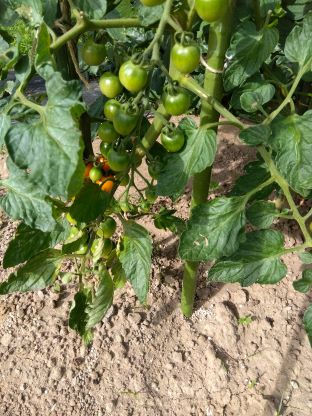</th>
    <th>EC</th>
    <th>苗</th>
    <th>8*1*1</th>
    <th>石灰・肥料</th>
    <td>　</td><td>　</td><td>　</td>
      <td>　</td><td>　</td><td>　</td>
        <td>　</td><td>　</td><td>　</td>
          <td>土</td><td>土</td><td>植</td>
            <td>　</td><td>　</td><td>紐</td>
              <td>　</td><td>■</td><td>■</td>
    <td>■3</td><td>■</td><td>　</td>
      <td>　</td><td>　</td><td>　</td>
        <td>　</td><td>　</td><td>　</td>
          <td>　</td><td>　</td><td>　</td>
            <td>　</td><td>　</td><td>　</td>
              <td>　</td><td>　</td><td>　</td>
  </tr>
  <tr>
    <th><del>トマト</del></th>
    <th></th>
    <th>SC</th>
    <th>苗</th>
    <th>4*1*1</th>
    <th>棒</th>
    <td>　</td><td>　</td><td>　</td>
      <td>　</td><td>　</td><td>　</td>
        <td>　</td><td>　</td><td>　</td>
          <td>土</td><td>土</td><td>植</td>
            <td>　</td><td>　</td><td>　</td>
              <td>　</td><td>■</td><td>■</td>
    <td>■</td><td>　</td><td>　</td>
      <td>　</td><td>　</td><td>　</td>
        <td>　</td><td>　</td><td>　</td>
          <td>　</td><td>　</td><td>　</td>
            <td>　</td><td>　</td><td>　</td>
              <td>　</td><td>　</td><td>　</td>
  </tr>
  <tr>
    <th><del>トマト</del></th>
    <th></th>
    <th>WC</th>
    <th>苗</th>
    <th>3*1*1</th>
    <th>数本仕立て</th>
    <td>　</td><td>　</td><td>　</td>
      <td>　</td><td>　</td><td>　</td>
        <td>　</td><td>　</td><td>　</td>
          <td>　</td><td>　</td><td>　</td>
            <td>植</td><td>　</td><td>　</td>
              <td>　</td><td>　</td><td>芽</td>
    <td>芽</td><td>■4 葉 ■</td><td>■6</td>
      <td>■8</td><td>■2 葉2</td><td>　</td>
        <td>　</td><td>　</td><td>　</td>
          <td>　</td><td>　</td><td>　</td>
            <td>　</td><td>　</td><td>　</td>
              <td>　</td><td>　</td><td>　</td>
  </tr>
  <tr>
    <th><del>きゅうり</del></th>
    <th></th>
    <th>WC</th>
    <th>苗</th>
    <th>4*1*1</th>
    <th>直立に支えて花の上下の葉と数本枝残しの繰り返し 花横の芽</th>
    <td>　</td><td>　</td><td>　</td>
      <td>　</td><td>　</td><td>　</td>
        <td>　</td><td>　</td><td>　</td>
          <td>　</td><td>　</td><td>　</td>
            <td>植</td><td>　</td><td>　</td>
              <td>　</td><td>網</td><td>■6 芽</td>
    <td>■6 芽 ■</td><td>■6 葉 ■</td><td>■7</td>
      <td>■5 葉</td><td>■</td><td>　</td>
        <td>　</td><td>　</td><td>　</td>
          <td>　</td><td>　</td><td>　</td>
            <td>　</td><td>　</td><td>　</td>
              <td>　</td><td>　</td><td>　</td>
  </tr>
  <tr>
    <th><del>きゅうり</del></th>
    <th>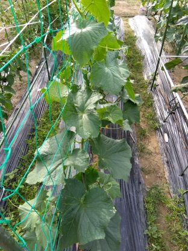</th>
    <th>SC</th>
    <th>苗</th>
    <th>2*1*1</th>
    <th>棒・網・太陽の向き</th>
    <td>　</td><td>　</td><td>　</td>
      <td>　</td><td>　</td><td>　</td>
        <td>　</td><td>　</td><td>　</td>
          <td>土</td><td>土</td><td>植</td>
            <td>棒</td><td>　</td><td>　</td>
              <td>■</td><td>■</td><td>■</td>
    <td>■</td><td>　</td><td>■</td>
      <td>　</td><td>　</td><td>　</td>
        <td>　</td><td>　</td><td>　</td>
          <td>　</td><td>　</td><td>　</td>
            <td>　</td><td>　</td><td>　</td>
              <td>　</td><td>　</td><td>　</td>
  </tr>
  <tr>
    <th><del>きゅうり</del></th>
    <th></th>
    <th>EC</th>
    <th>苗</th>
    <th>4*1*1</th>
    <th></th>
    <td>　</td><td>　</td><td>　</td>
      <td>　</td><td>　</td><td>　</td>
        <td>　</td><td>　</td><td>　</td>
          <td>　</td><td>　</td><td>　</td>
            <td>　</td><td>植</td><td>　</td>
              <td>　</td><td>　</td><td>■4</td>
    <td>■3 芽</td><td>■4</td><td>■</td>
      <td>　</td><td>■</td><td>　</td>
        <td>　</td><td>　</td><td>　</td>
          <td>　</td><td>　</td><td>　</td>
            <td>　</td><td>　</td><td>　</td>
              <td>　</td><td>　</td><td>　</td>
  </tr>
  <tr>
    <th><del>きゅうり</del></th>
    <th></th>
    <th>NE</th>
    <th>苗</th>
    <th>3*1*1</th>
    <th></th>
    <td>　</td><td>　</td><td>　</td>
      <td>　</td><td>　</td><td>　</td>
        <td>　</td><td>　</td><td>　</td>
          <td>　</td><td>　</td><td>　</td>
            <td>　</td><td>　</td><td>　</td>
              <td>　</td><td>　</td><td>　</td>
    <td>■2 ■ 芽</td><td>■4</td><td>■</td>
      <td>　</td><td>■</td><td>　</td>
        <td>　</td><td>　</td><td>　</td>
          <td>　</td><td>　</td><td>　</td>
            <td>　</td><td>　</td><td>　</td>
              <td>　</td><td>　</td><td>　</td>
  </tr>
  <tr>
    <th><del>ピーマン</del></th>
    <th></th>
    <th>SC</th>
    <th>苗</th>
    <th>2*1*1</th>
    <th></th>
    <td>　</td><td>　</td><td>　</td>
      <td>　</td><td>　</td><td>　</td>
        <td>　</td><td>　</td><td>　</td>
          <td>土</td><td>土</td><td>植</td>
            <td>棒</td><td>　</td><td>　</td>
              <td>　</td><td>　</td><td>　</td>
    <td>　</td><td>■</td><td>　</td>
      <td>　</td><td>　</td><td>　</td>
        <td>　</td><td>　</td><td>　</td>
          <td>■</td><td>　</td><td>　</td>
            <td>　</td><td>　</td><td>■</td>
              <td>　</td><td>■</td><td>　</td>
  </tr>
  <tr>
    <th><del>ナス</del></th>
    <th></th>
    <th>CC</th>
    <th>苗</th>
    <th>3*1*1</th>
    <th></th>
    <td>　</td><td>　</td><td>　</td>
      <td>　</td><td>　</td><td>　</td>
        <td>　</td><td>　</td><td>　</td>
          <td>土</td><td>土</td><td>植</td>
            <td>棒</td><td>　</td><td>紐</td>
              <td>土</td><td>　</td><td>　</td>
    <td>■</td><td>　</td><td>■</td>
      <td>　</td><td>　</td><td>　</td>
        <td>　</td><td>　</td><td>　</td>
          <td>　</td><td>　</td><td>　</td>
            <td>　</td><td>　</td><td>　</td>
              <td>　</td><td>　</td><td>　</td>
  </tr>
  <tr>
    <th><del>コーン</del></th>
    <th></th>
    <th>CC</th>
    <th>苗</th>
    <th>13*2*1</th>
    <th>受粉</th>
    <td>　</td><td>　</td><td>　</td>
      <td>　</td><td>　</td><td>　</td>
        <td>　</td><td>　</td><td>　</td>
          <td>土</td><td>土</td><td>植</td>
            <td>棒</td><td>　</td><td>　</td>
              <td>土 虫</td><td>　</td><td>　</td>
    <td>■2</td><td>　</td><td>　</td>
      <td>　</td><td>　</td><td>　</td>
        <td>　</td><td>　</td><td>　</td>
          <td>　</td><td>　</td><td>　</td>
            <td>　</td><td>　</td><td>　</td>
              <td>　</td><td>　</td><td>　</td>
  </tr>
  <tr>
    <th><del>大葉</del></th>
    <th></th>
    <th>SC</th>
    <th>苗</th>
    <th>10*3*1</th>
    <th>青3赤3残し</th>
    <td>　</td><td>　</td><td>　</td>
      <td>　</td><td>　</td><td>　</td>
        <td>　</td><td>　</td><td>　</td>
          <td>土</td><td>土</td><td>植</td>
            <td>　</td><td>　</td><td>■2</td>
              <td>■2</td><td>芽</td><td>　</td>
    <td>　</td><td>　</td><td>　</td>
      <td>　</td><td>　</td><td>　</td>
        <td>　</td><td>　</td><td>　</td>
          <td>土</td><td>　</td><td>　</td>
            <td>　</td><td>　</td><td>　</td>
              <td>　</td><td>　</td><td>　</td>
  </tr>
  <tr>
    <th><del>大葉</del></th>
    <th></th>
    <th>EC</th>
    <th>苗</th>
    <th>4*1*1</th>
    <th></th>
    <td>　</td><td>　</td><td>　</td>
      <td>　</td><td>　</td><td>　</td>
        <td>　</td><td>　</td><td>　</td>
          <td>　</td><td>　</td><td>　</td>
            <td>　</td><td>　</td><td>植</td>
              <td>　</td><td>　</td><td>　</td>
    <td>　</td><td>　</td><td>　</td>
      <td>　</td><td>　</td><td>　</td>
        <td>　</td><td>　</td><td>　</td>
          <td>　</td><td>　</td><td>　</td>
            <td>　</td><td>　</td><td>　</td>
              <td>　</td><td>　</td><td>　</td>
  </tr>
  <tr>
    <th><del>枝豆</del></th>
    <th>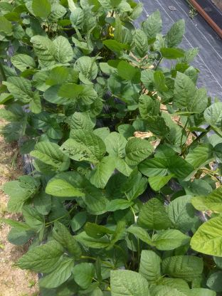</th>
    <th>SC</th>
    <th>苗</th>
    <th>8*2*1</th>
    <th></th>
    <td>　</td><td>　</td><td>　</td>
      <td>　</td><td>　</td><td>　</td>
        <td>　</td><td>　</td><td>　</td>
          <td>土</td><td>土</td><td>　</td>
            <td>　</td><td>植</td><td>　</td>
              <td>　</td><td>　</td><td>　</td>
    <td>　</td><td>　</td><td>　</td>
      <td>■</td><td>　</td><td>　</td>
        <td>　</td><td>　</td><td>　</td>
          <td>　</td><td>　</td><td>　</td>
            <td>　</td><td>　</td><td>　</td>
              <td>　</td><td>　</td><td>　</td>
  </tr>
  <tr>
    <th><del>枝豆</del></th>
    <th></th>
    <th>SE</th>
    <th>苗</th>
    <th>2*2*1</th>
    <th></th>
    <td>　</td><td>　</td><td>　</td>
      <td>　</td><td>　</td><td>　</td>
        <td>　</td><td>　</td><td>　</td>
          <td>　</td><td>　</td><td>　</td>
            <td>　</td><td>植</td><td>　</td>
              <td>　</td><td>　</td><td>　</td>
    <td>　</td><td>　</td><td>　</td>
      <td>■</td><td>　</td><td>　</td>
        <td>　</td><td>　</td><td>　</td>
          <td>　</td><td>　</td><td>　</td>
            <td>　</td><td>　</td><td>　</td>
              <td>　</td><td>　</td><td>　</td>
  </tr>
  <tr>
    <th><del>ズッキーニ</del></th>
    <th></th>
    <th>NE</th>
    <th>苗</th>
    <th>4*1*1</th>
    <th>2本組</th>
    <td>　</td><td>　</td><td>　</td>
      <td>　</td><td>　</td><td>　</td>
        <td>　</td><td>　</td><td>　</td>
          <td>　</td><td>　</td><td>　</td>
            <td>　</td><td>植</td><td>　</td>
              <td>　</td><td>■2</td><td>■2 芽</td>
    <td>　</td><td>　</td><td>　</td>
      <td>　</td><td>　</td><td>　</td>
        <td>　</td><td>回</td><td>　</td>
          <td>　</td><td>　</td><td>　</td>
            <td>　</td><td>　</td><td>　</td>
              <td>　</td><td>　</td><td>　</td>
  </tr>
  <tr>
    <th><del>ズッキーニ</del></th>
    <th></th>
    <th>SE</th>
    <th>苗</th>
    <th>4*1*1</th>
    <th>2本組</th>
    <td>　</td><td>　</td><td>　</td>
      <td>　</td><td>　</td><td>　</td>
        <td>　</td><td>　</td><td>　</td>
          <td>　</td><td>　</td><td>　</td>
            <td>　</td><td>植</td><td>　</td>
              <td>　</td><td>■ 芽</td><td>　</td>
    <td>　</td><td>　</td><td>　</td>
      <td>　</td><td>　</td><td>　</td>
        <td>　</td><td>　</td><td>　</td>
          <td>　</td><td>　</td><td>　</td>
            <td>　</td><td>　</td><td>　</td>
              <td>　</td><td>　</td><td>　</td>
  </tr>
  <tr>
    <th><del>ズッキーニ</del></th>
    <th></th>
    <th>SC</th>
    <th>種</th>
    <th>2*2*1</th>
    <th>様子見 風で折れた茎の上部を[切]除 雄花は開花 雌花の開花失敗で小さい 加熱調理2本</th>
    <td>　</td><td>　</td><td>　</td>
      <td>　</td><td>　</td><td>　</td>
        <td>　</td><td>　</td><td>　</td>
          <td>　</td><td>　</td><td>　</td>
            <td>　</td><td>　</td><td>　</td>
              <td>　</td><td>　</td><td>　</td>
    <td>　</td><td>　</td><td>　</td>
      <td>　</td><td>　</td><td>　</td>
        <td>　</td><td>種</td><td>◎</td>
          <td>種 ○</td><td>　</td><td>花 受 切 □</td>
            <td>葉 ■</td><td>　</td><td>　</td>
              <td>　</td><td>　</td><td>　</td>
  </tr>
  <tr>
    <th><del>オクラ</del></th>
    <th></th>
    <th>WC</th>
    <th>苗</th>
    <th>14*1*1</th>
    <th></th>
    <td>　</td><td>　</td><td>　</td>
      <td>　</td><td>　</td><td>　</td>
        <td>　</td><td>　</td><td>　</td>
          <td>　</td><td>　</td><td>　</td>
            <td>　</td><td>　</td><td>植</td>
              <td>　</td><td>　</td><td>　</td>
    <td>　</td><td>　</td><td>　</td>
      <td>　</td><td>　</td><td>　</td>
        <td>　</td><td>　</td><td>　</td>
          <td>　</td><td>　</td><td>　</td>
            <td>　</td><td>　</td><td>　</td>
              <td>　</td><td>　</td><td>　</td>
  </tr>
  <tr>
    <th>オクラ</th>
    <th></th>
    <th>EC</th>
    <th>苗</th>
    <th>14*1*1</th>
    <th></th>
    <td>　</td><td>　</td><td>　</td>
      <td>　</td><td>　</td><td>　</td>
        <td>　</td><td>　</td><td>　</td>
          <td>　</td><td>　</td><td>　</td>
            <td>　</td><td>　</td><td>植</td>
              <td>　</td><td>　</td><td>■ 芽</td>
    <td>■2</td><td>　</td><td>　</td>
      <td>■</td><td>　</td><td>　</td>
        <td>■</td><td>■</td><td>■</td>
          <td>■</td><td>　</td><td>　</td>
            <td>　</td><td>　</td><td>　</td>
              <td>　</td><td>　</td><td>　</td>
  </tr>
  <tr>
    <th><del>玉葱</del></th>
    <th></th>
    <th>WC</th>
    <th></th>
    <th></th>
    <th></th>
    <td>　</td><td>　</td><td>　</td>
      <td>　</td><td>　</td><td>　</td>
        <td>　</td><td>　</td><td>　</td>
          <td>　</td><td>　</td><td>　</td>
            <td>　</td><td>　</td><td>■ 乾</td>
              <td>■ 乾</td><td>　</td><td>　</td>
    <td>　</td><td>　</td><td>　</td>
      <td>　</td><td>　</td><td>　</td>
        <td>　</td><td>　</td><td>　</td>
          <td>　</td><td>　</td><td>　</td>
            <td>　</td><td>　</td><td>　</td>
              <td>　</td><td>　</td><td>　</td>
  </tr>
  <tr>
    <th><del>うり</del></th>
    <th>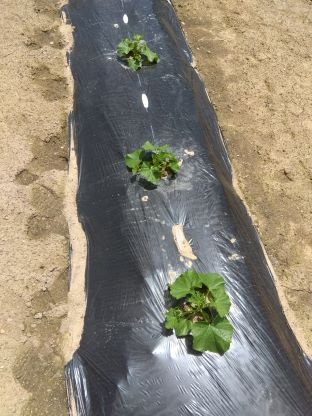</th>
    <th>WC</th>
    <th>苗</th>
    <th>6*1*1</th>
    <th>玉葱の次</th>
    <td>　</td><td>　</td><td>　</td>
      <td>　</td><td>　</td><td>　</td>
        <td>　</td><td>　</td><td>　</td>
          <td>　</td><td>　</td><td>　</td>
            <td>　</td><td>　</td><td>　</td>
              <td>　</td><td>　</td><td>土</td>
    <td>植</td><td>　</td><td>　</td>
      <td>　</td><td>■2</td><td>　</td>
        <td>　</td><td>　</td><td>　</td>
          <td>　</td><td>　</td><td>　</td>
            <td>　</td><td>　</td><td>　</td>
              <td>　</td><td>　</td><td>　</td>
  </tr>
  <tr>
    <th>にら</th>
    <th></th>
    <th>NC</th>
    <th></th>
    <th></th>
    <th>バッタがハマスゲ同様に食べる</th>
    <td>　</td><td>　</td><td>　</td>
      <td>　</td><td>　</td><td>　</td>
        <td>　</td><td>　</td><td>　</td>
          <td>　</td><td>　</td><td>　</td>
            <td>　</td><td>　</td><td>　</td>
              <td>　</td><td>　</td><td>土</td>
    <td>　</td><td>　</td><td>　</td>
      <td>　</td><td>　</td><td>　</td>
        <td>葉</td><td>　</td><td>　</td>
          <td>　</td><td>　</td><td>　</td>
            <td>　</td><td>　</td><td>　</td>
              <td>　</td><td>　</td><td>　</td>
  </tr>
  <tr>
    <th></th>
    <th></th>
    <th>W</th>
    <th></th>
    <th>畝<del>13</del>9</th>
    <th>直進・広め ジャガイモ ニンニク 赤カブ 春菊 大根 ほうれん草 小松菜 白菜 サツマイモ（仮）</th>
    <td>　</td><td>　</td><td>　</td>
      <td>　</td><td>　</td><td>　</td>
        <td>　</td><td>　</td><td>　</td>
          <td>　</td><td>　</td><td>　</td>
            <td>　</td><td>　</td><td>　</td>
              <td>　</td><td>　</td><td>　</td>
    <td>　</td><td>　</td><td>　</td>
      <td>　</td><td>灰 耕 土</td><td>　</td>
        <td>土 耕 土 耕 灰 耕 肥 耕</td><td>畝3 肥</td><td>　</td>
          <td>　</td><td>　</td><td>　</td>
            <td>　</td><td>　</td><td>　</td>
              <td>　</td><td>　</td><td>　</td>
  </tr>
  <tr>
    <th></th>
    <th></th>
    <th>NE NC SE SC CC</th>
    <th></th>
    <th></th>
    <th>貝灰は即植付け可 人参 玉葱</th>
    <td>　</td><td>　</td><td>　</td>
      <td>　</td><td>　</td><td>　</td>
        <td>　</td><td>　</td><td>　</td>
          <td>　</td><td>　</td><td>　</td>
            <td>　</td><td>　</td><td>　</td>
              <td>　</td><td>　</td><td>　</td>
    <td>　</td><td>　</td><td>　</td>
      <td>　</td><td>　</td><td>　</td>
        <td>耕</td><td>　</td><td>耕2</td>
          <td>耕</td><td>貝 畝1</td><td>　</td>
            <td>　</td><td>　</td><td>　</td>
              <td>　</td><td>　</td><td>　</td>
  </tr>
</tbody>
</table>
</body>
</html>
