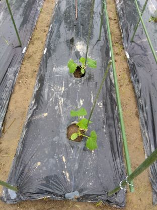

<!DOCTYPE html>
<html lang="ja">
<head>
  <meta charset="utf-8">
  <meta name="description" content="note">
  <meta name="author" content="online-simulator.github.io">
  <link rel="stylesheet" type="text/css" href="css/common.css">
  <link rel="stylesheet" type="text/css" href="css/color.css">
  <link rel="stylesheet" type="text/css" href="css/size.css">
<body>
<table>
<caption>2024年 [土]作り　[芽]かき　[種]まき　定[植]　[重]曹1/1000倍　∩トンネル　○◎発芽　■収穫</caption>
<thead>
  <tr>
    <th>品種</th>
    <th>写真</th>
    <th>区画</th>
    <th>種苗</th>
    <th>個*条*畝数</th>
    <th>備考</th>
    <th colspan="3">01月</th>
    <th colspan="3">02月</th>
    <th colspan="3">03月</th>
    <th colspan="3">04月</th>
    <th colspan="3">05月</th>
    <th colspan="3">06月</th>
    <th colspan="3">07月</th>
    <th colspan="3">08月</th>
    <th colspan="3">09月</th>
    <th colspan="3">10月</th>
    <th colspan="3">11月</th>
    <th colspan="3">12月</th>
  </tr>
</thead>
<tbody>
  <tr>
    <th>金柑</th>
    <th></th>
    <th>NE</th>
    <th></th>
    <th>1</th>
    <th>水道・畦道・風通し</th>
    <td>　</td><td>　</td><td>　</td>
      <td>　</td><td>　</td><td>　</td>
        <td>　</td><td>　</td><td>■</td>
          <td>■</td><td>　</td><td>■3</td>
            <td>　</td><td>　</td><td>■</td>
              <td>　</td><td>　</td><td>　</td>
    <td>　</td><td>　</td><td>　</td>
      <td>　</td><td>　</td><td>　</td>
        <td>　</td><td>　</td><td>　</td>
          <td>　</td><td>　</td><td>　</td>
            <td>　</td><td>　</td><td>　</td>
              <td>　</td><td>　</td><td>　</td>
  </tr>
  <tr>
    <th>みかん</th>
    <th></th>
    <th>SW</th>
    <th></th>
    <th>1+1</th>
    <th>様子見</th>
    <td>　</td><td>　</td><td>　</td>
      <td>　</td><td>　</td><td>　</td>
        <td>　</td><td>　</td><td>　</td>
          <td>　</td><td>　</td><td>　</td>
            <td>　</td><td>　</td><td>　</td>
              <td>　</td><td>　</td><td>　</td>
    <td>　</td><td>　</td><td>　</td>
      <td>　</td><td>　</td><td>　</td>
        <td>　</td><td>　</td><td>　</td>
          <td>　</td><td>　</td><td>　</td>
            <td>　</td><td>　</td><td>　</td>
              <td>　</td><td>　</td><td>　</td>
  </tr>
  <tr>
    <th>柿</th>
    <th></th>
    <th>E</th>
    <th></th>
    <th>2+2+1</th>
    <th>甘柿接ぎ木・日当たり</th>
    <td>　</td><td>　</td><td>　</td>
      <td>　</td><td>　</td><td>　</td>
        <td>　</td><td>　</td><td>　</td>
          <td>　</td><td>芽</td><td>　</td>
            <td>　</td><td>　</td><td>　</td>
              <td>　</td><td>　</td><td>　</td>
    <td>　</td><td>　</td><td>　</td>
      <td>　</td><td>　</td><td>　</td>
        <td>　</td><td>　</td><td>　</td>
          <td>　</td><td>　</td><td>　</td>
            <td>　</td><td>　</td><td>　</td>
              <td>　</td><td>　</td><td>　</td>
  </tr>
  <tr>
    <th>菊</th>
    <th></th>
    <th>EC</th>
    <th>元株</th>
    <th>5*2*1</th>
    <th>様子見</th>
    <td>　</td><td>　</td><td>　</td>
      <td>　</td><td>　</td><td>　</td>
        <td>　</td><td>　</td><td>　</td>
          <td>土</td><td>　</td><td>　</td>
            <td>　</td><td>棒</td><td>　</td>
              <td>　</td><td>　</td><td>　</td>
    <td>　</td><td>　</td><td>　</td>
      <td>　</td><td>　</td><td>　</td>
        <td>　</td><td>　</td><td>　</td>
          <td>　</td><td>　</td><td>　</td>
            <td>　</td><td>　</td><td>　</td>
              <td>　</td><td>　</td><td>　</td>
  </tr>
  <tr>
    <th>菊</th>
    <th></th>
    <th>SE</th>
    <th>株</th>
    <th>14*1*1</th>
    <th>3本枝残し</th>
    <td>　</td><td>　</td><td>　</td>
      <td>　</td><td>　</td><td>　</td>
        <td>　</td><td>　</td><td>土</td>
          <td>植</td><td>　</td><td>土</td>
            <td>　</td><td>虫 棒</td><td>　</td>
              <td>　</td><td>　</td><td>　</td>
    <td>　</td><td>　</td><td>　</td>
      <td>　</td><td>　</td><td>　</td>
        <td>　</td><td>　</td><td>　</td>
          <td>　</td><td>　</td><td>　</td>
            <td>　</td><td>　</td><td>　</td>
              <td>　</td><td>　</td><td>　</td>
  </tr>
  <tr>
    <th>ネギ</th>
    <th></th>
    <th>SE</th>
    <th>株</th>
    <th>10*1*4</th>
    <th></th>
    <td>土</td><td>植</td><td>　</td>
      <td>　</td><td>　</td><td>　</td>
        <td>　</td><td>　</td><td>■</td>
          <td>■</td><td>土</td><td>　</td>
            <td>芽</td><td>薹 ■</td><td>■</td>
              <td>　</td><td>　</td><td>　</td>
    <td>　</td><td>　</td><td>　</td>
      <td>　</td><td>　</td><td>　</td>
        <td>　</td><td>　</td><td>　</td>
          <td>　</td><td>　</td><td>　</td>
            <td>　</td><td>　</td><td>　</td>
              <td>　</td><td>　</td><td>　</td>
  </tr>
  <tr>
    <th>ネギ</th>
    <th></th>
    <th>SC</th>
    <th></th>
    <th>10*1*1</th>
    <th></th>
    <td>　</td><td>　</td><td>　</td>
      <td>　</td><td>　</td><td>　</td>
        <td>　</td><td>　</td><td>■</td>
          <td>■</td><td>■</td><td>　</td>
            <td>芽</td><td>薹</td><td>　</td>
              <td>　</td><td>　</td><td>　</td>
    <td>　</td><td>　</td><td>　</td>
      <td>　</td><td>　</td><td>　</td>
        <td>　</td><td>　</td><td>　</td>
          <td>　</td><td>　</td><td>　</td>
            <td>　</td><td>　</td><td>　</td>
              <td>　</td><td>　</td><td>　</td>
  </tr>
  <tr>
    <th>人参</th>
    <th></th>
    <th>NC</th>
    <th>条</th>
    <th>20*3*1</th>
    <th>土の硬さ</th>
    <td>種 ∩</td><td>　</td><td>◎</td>
      <td>　</td><td><del>∩</del></td><td>　</td>
        <td>　</td><td>　</td><td>芽</td>
          <td>芽</td><td>　</td><td>土</td>
            <td>■</td><td>■2</td><td>　</td>
              <td>　</td><td>　</td><td>　</td>
    <td>　</td><td>　</td><td>　</td>
      <td>　</td><td>　</td><td>　</td>
        <td>　</td><td>　</td><td>　</td>
          <td>　</td><td>　</td><td>　</td>
            <td>　</td><td>　</td><td>　</td>
              <td>　</td><td>　</td><td>　</td>
  </tr>
  <tr>
    <th>人参</th>
    <th></th>
    <th>SW</th>
    <th>点</th>
    <th>20*3*1</th>
    <th></th>
    <td>　</td><td>土</td><td>　</td>
      <td>種</td><td>　</td><td>◎</td>
        <td>　</td><td>　</td><td>　</td>
          <td>　</td><td>　</td><td>土</td>
            <td>　</td><td>　</td><td>　</td>
              <td>　</td><td>　</td><td>　</td>
    <td>　</td><td>　</td><td>　</td>
      <td>　</td><td>　</td><td>　</td>
        <td>　</td><td>　</td><td>　</td>
          <td>　</td><td>　</td><td>　</td>
            <td>　</td><td>　</td><td>　</td>
              <td>　</td><td>　</td><td>　</td>
  </tr>
  <tr>
    <th><del>大根</del> 春菊</th>
    <th></th>
    <th>WC</th>
    <th>条</th>
    <th>30*3*1</th>
    <th>乾燥⇒肥料</th>
    <td>　</td><td>　</td><td>　</td>
      <td>　</td><td>　</td><td>　</td>
        <td>　</td><td>　</td><td>　</td>
          <td>■ 土</td><td>種</td><td>◎</td>
            <td>　</td><td>　</td><td>■</td>
              <td>　</td><td>　</td><td>　</td>
    <td>　</td><td>　</td><td>　</td>
      <td>　</td><td>　</td><td>　</td>
        <td>　</td><td>　</td><td>　</td>
          <td>　</td><td>　</td><td>　</td>
            <td>　</td><td>　</td><td>　</td>
              <td>　</td><td>　</td><td>　</td>
  </tr>
  <tr>
    <th>ジャガイモ</th>
    <th></th>
    <th>NC CC</th>
    <th>種</th>
    <th>10*1*4</th>
    <th>芽かき・追肥・土寄せ</th>
    <td>　</td><td>　</td><td>土</td>
      <td>　</td><td>種</td><td>　</td>
        <td>　</td><td>◎</td><td>　</td>
          <td>芽</td><td>土</td><td>土 花</td>
            <td>　</td><td>　</td><td>■2</td>
              <td>　</td><td>　</td><td>　</td>
    <td>　</td><td>　</td><td>　</td>
      <td>　</td><td>　</td><td>　</td>
        <td>　</td><td>　</td><td>　</td>
          <td>　</td><td>　</td><td>　</td>
            <td>　</td><td>　</td><td>　</td>
              <td>　</td><td>　</td><td>　</td>
  </tr>
  <tr>
    <th><del>ほうれん草</del> ナス</th>
    <th></th>
    <th>EC</th>
    <th>苗</th>
    <th>6*1*1</th>
    <th></th>
    <td>　</td><td>　</td><td>　</td>
      <td>　</td><td>　</td><td>　</td>
        <td>　</td><td>　</td><td>　</td>
          <td>■</td><td>■ 土</td><td>植</td>
            <td>　</td><td>　</td><td>　</td>
              <td>　</td><td>　</td><td>　</td>
    <td>　</td><td>　</td><td>　</td>
      <td>　</td><td>　</td><td>　</td>
        <td>　</td><td>　</td><td>　</td>
          <td>　</td><td>　</td><td>　</td>
            <td>　</td><td>　</td><td>　</td>
              <td>　</td><td>　</td><td>　</td>
  </tr>
  <tr>
    <th>ほうれん草</th>
    <th></th>
    <th>NW</th>
    <th>点 条</th>
    <th>30*2*1 50*3*1</th>
    <th></th>
    <td>　</td><td>　</td><td>　</td>
      <td>　</td><td>　</td><td>種</td>
        <td>　</td><td>　</td><td>○</td>
          <td>　</td><td>種 ◎</td><td>土 ■</td>
            <td>　</td><td>芽2</td><td>　</td>
              <td>　</td><td>　</td><td>　</td>
    <td>　</td><td>　</td><td>　</td>
      <td>　</td><td>　</td><td>　</td>
        <td>　</td><td>　</td><td>　</td>
          <td>　</td><td>　</td><td>　</td>
            <td>　</td><td>　</td><td>　</td>
              <td>　</td><td>　</td><td>　</td>
  </tr>
  <tr>
    <th><del>小松菜</del></th>
    <th></th>
    <th>NW</th>
    <th>点</th>
    <th>50*3*1</th>
    <th>葉裏の白浮きを除外</th>
    <td>　</td><td>　</td><td>　</td>
      <td>　</td><td>　</td><td>種</td>
        <td>　</td><td>　</td><td>◎ ∩</td>
          <td>虫</td><td>土 重</td><td>重 土 芽</td>
            <td>芽 ■</td><td>■</td><td>　</td>
              <td>　</td><td>　</td><td>　</td>
    <td>　</td><td>　</td><td>　</td>
      <td>　</td><td>　</td><td>　</td>
        <td>　</td><td>　</td><td>　</td>
          <td>　</td><td>　</td><td>　</td>
            <td>　</td><td>　</td><td>　</td>
              <td>　</td><td>　</td><td>　</td>
  </tr>
  <tr>
    <th>キャベツ</th>
    <th></th>
    <th>SW</th>
    <th>苗</th>
    <th>15*2*1</th>
    <th>葉20枚 色薄で根先に追肥</th>
    <td>　</td><td>　</td><td>　</td>
      <td>　</td><td>　</td><td>土</td>
        <td>　</td><td>植 ∩</td><td>土</td>
          <td>　</td><td>　</td><td>　</td>
            <td>　</td><td>根</td><td>　</td>
              <td>　</td><td>　</td><td>　</td>
    <td>　</td><td>　</td><td>　</td>
      <td>　</td><td>　</td><td>　</td>
        <td>　</td><td>　</td><td>　</td>
          <td>　</td><td>　</td><td>　</td>
            <td>　</td><td>　</td><td>　</td>
              <td>　</td><td>　</td><td>　</td>
  </tr>
  <tr>
    <th>そら豆</th>
    <th></th>
    <th>SW</th>
    <th>苗</th>
    <th>15*1*1</th>
    <th>花⇒3本残し</th>
    <td>　</td><td>　</td><td>　</td>
      <td>　</td><td>　</td><td>土</td>
        <td>　</td><td>植 ∩</td><td>土</td>
          <td>　</td><td>　</td><td>芽 <del>∩</del> 紐 銀</td>
            <td>　</td><td>　</td><td>　</td>
              <td>　</td><td>　</td><td>　</td>
    <td>　</td><td>　</td><td>　</td>
      <td>　</td><td>　</td><td>　</td>
        <td>　</td><td>　</td><td>　</td>
          <td>　</td><td>　</td><td>　</td>
            <td>　</td><td>　</td><td>　</td>
              <td>　</td><td>　</td><td>　</td>
  </tr>
  <tr>
    <th>ブロッコリー</th>
    <th></th>
    <th>SW</th>
    <th>苗</th>
    <th>4*1*1</th>
    <th>葉と根の広がり具合</th>
    <td>　</td><td>　</td><td>　</td>
      <td>　</td><td>　</td><td>土</td>
        <td>　</td><td>植 ∩</td><td>土</td>
          <td>　</td><td>　</td><td>∩</td>
            <td>　</td><td>　</td><td>■1/4</td>
              <td>　</td><td>　</td><td>　</td>
    <td>　</td><td>　</td><td>　</td>
      <td>　</td><td>　</td><td>　</td>
        <td>　</td><td>　</td><td>　</td>
          <td>　</td><td>　</td><td>　</td>
            <td>　</td><td>　</td><td>　</td>
              <td>　</td><td>　</td><td>　</td>
  </tr>
  <tr>
    <th>セロリ</th>
    <th></th>
    <th>WC</th>
    <th>苗</th>
    <th>10*1*1</th>
    <th></th>
    <td>　</td><td>　</td><td>　</td>
      <td>　</td><td>　</td><td>土</td>
        <td>　</td><td>植 ∩</td><td>土</td>
          <td>　</td><td>　</td><td>芽</td>
            <td>　</td><td>■2</td><td>　</td>
              <td>　</td><td>　</td><td>　</td>
    <td>　</td><td>　</td><td>　</td>
      <td>　</td><td>　</td><td>　</td>
        <td>　</td><td>　</td><td>　</td>
          <td>　</td><td>　</td><td>　</td>
            <td>　</td><td>　</td><td>　</td>
              <td>　</td><td>　</td><td>　</td>
  </tr>
  <tr>
    <th>唐辛子</th>
    <th></th>
    <th>WC</th>
    <th>点</th>
    <th>4*1*1</th>
    <th>1本残し</th>
    <td>　</td><td>　</td><td>　</td>
      <td>　</td><td>　</td><td>　</td>
        <td>　</td><td>　</td><td>　</td>
          <td>　</td><td>　</td><td>種</td>
            <td>　</td><td>　</td><td>　</td>
              <td>　</td><td>　</td><td>　</td>
    <td>　</td><td>　</td><td>　</td>
      <td>　</td><td>　</td><td>　</td>
        <td>　</td><td>　</td><td>　</td>
          <td>　</td><td>　</td><td>　</td>
            <td>　</td><td>　</td><td>　</td>
              <td>　</td><td>　</td><td>　</td>
  </tr>
  <tr>
    <th>カブ</th>
    <th></th>
    <th>SC</th>
    <th>点</th>
    <th>50*2*2</th>
    <th>葉裏の白浮き除外</th>
    <td>　</td><td>　</td><td>　</td>
      <td>　</td><td>　</td><td>土</td>
        <td>　</td><td>種</td><td>◎</td>
          <td>∩</td><td>土 重</td><td>土 芽2</td>
            <td>芽3</td><td>■2</td><td>■2</td>
              <td>　</td><td>　</td><td>　</td>
    <td>　</td><td>　</td><td>　</td>
      <td>　</td><td>　</td><td>　</td>
        <td>　</td><td>　</td><td>　</td>
          <td>　</td><td>　</td><td>　</td>
            <td>　</td><td>　</td><td>　</td>
              <td>　</td><td>　</td><td>　</td>
  </tr>
  <tr>
    <th><del>赤カブ</del></th>
    <th></th>
    <th>NW</th>
    <th>条</th>
    <th>30*4*1</th>
    <th></th>
    <td>　</td><td>　</td><td>　</td>
      <td>　</td><td>　</td><td>　</td>
        <td>　</td><td>種</td><td>◎</td>
          <td>　</td><td>　</td><td>土 芽</td>
            <td>■</td><td>　</td><td>　</td>
              <td>　</td><td>　</td><td>　</td>
    <td>　</td><td>　</td><td>　</td>
      <td>　</td><td>　</td><td>　</td>
        <td>　</td><td>　</td><td>　</td>
          <td>　</td><td>　</td><td>　</td>
            <td>　</td><td>　</td><td>　</td>
              <td>　</td><td>　</td><td>　</td>
  </tr>
  <tr>
    <th>ミョウガ</th>
    <th></th>
    <th>SW</th>
    <th></th>
    <th></th>
    <th></th>
    <td>　</td><td>　</td><td>　</td>
      <td>　</td><td>　</td><td>　</td>
        <td>　</td><td>　</td><td>網</td>
          <td>　</td><td>　</td><td>　</td>
            <td>　</td><td>　</td><td>　</td>
              <td>　</td><td>　</td><td>　</td>
    <td>　</td><td>　</td><td>　</td>
      <td>　</td><td>　</td><td>　</td>
        <td>　</td><td>　</td><td>　</td>
          <td>　</td><td>　</td><td>　</td>
            <td>　</td><td>　</td><td>　</td>
              <td>　</td><td>　</td><td>　</td>
  </tr>
  <tr>
    <th>ニンニク</th>
    <th></th>
    <th>WC</th>
    <th></th>
    <th></th>
    <th>肥料・重曹</th>
    <td>　</td><td>　</td><td>　</td>
      <td>　</td><td>　</td><td>　</td>
        <td>　</td><td>　</td><td>　</td>
          <td>　</td><td>　</td><td>　</td>
            <td>　</td><td>　</td><td>　</td>
              <td>　</td><td>　</td><td>　</td>
    <td>　</td><td>　</td><td>　</td>
      <td>　</td><td>　</td><td>　</td>
        <td>　</td><td>　</td><td>　</td>
          <td>　</td><td>　</td><td>　</td>
            <td>　</td><td>　</td><td>　</td>
              <td>　</td><td>　</td><td>　</td>
  </tr>
  <tr>
    <th>トマト</th>
    <th></th>
    <th>EC</th>
    <th>苗</th>
    <th>8*1*1</th>
    <th>石灰・肥料</th>
    <td>　</td><td>　</td><td>　</td>
      <td>　</td><td>　</td><td>　</td>
        <td>　</td><td>　</td><td>　</td>
          <td>土</td><td>土</td><td>植</td>
            <td>　</td><td>　</td><td>紐</td>
              <td>　</td><td>　</td><td>　</td>
    <td>　</td><td>　</td><td>　</td>
      <td>　</td><td>　</td><td>　</td>
        <td>　</td><td>　</td><td>　</td>
          <td>　</td><td>　</td><td>　</td>
            <td>　</td><td>　</td><td>　</td>
              <td>　</td><td>　</td><td>　</td>
  </tr>
  <tr>
    <th>トマト</th>
    <th></th>
    <th>SC</th>
    <th>苗</th>
    <th>4*1*1</th>
    <th>棒</th>
    <td>　</td><td>　</td><td>　</td>
      <td>　</td><td>　</td><td>　</td>
        <td>　</td><td>　</td><td>　</td>
          <td>土</td><td>土</td><td>植</td>
            <td>　</td><td>　</td><td>　</td>
              <td>　</td><td>　</td><td>　</td>
    <td>　</td><td>　</td><td>　</td>
      <td>　</td><td>　</td><td>　</td>
        <td>　</td><td>　</td><td>　</td>
          <td>　</td><td>　</td><td>　</td>
            <td>　</td><td>　</td><td>　</td>
              <td>　</td><td>　</td><td>　</td>
  </tr>
  <tr>
    <th>きゅうり</th>
    <th></th>
    <th>SC</th>
    <th>苗</th>
    <th>2*1*1</th>
    <th>棒・網・太陽の向き</th>
    <td>　</td><td>　</td><td>　</td>
      <td>　</td><td>　</td><td>　</td>
        <td>　</td><td>　</td><td>　</td>
          <td>土</td><td>土</td><td>植</td>
            <td>棒</td><td>　</td><td>　</td>
              <td>　</td><td>　</td><td>　</td>
    <td>　</td><td>　</td><td>　</td>
      <td>　</td><td>　</td><td>　</td>
        <td>　</td><td>　</td><td>　</td>
          <td>　</td><td>　</td><td>　</td>
            <td>　</td><td>　</td><td>　</td>
              <td>　</td><td>　</td><td>　</td>
  </tr>
  <tr>
    <th>きゅうり</th>
    <th></th>
    <th>EC</th>
    <th>苗</th>
    <th>4*1*1</th>
    <th></th>
    <td>　</td><td>　</td><td>　</td>
      <td>　</td><td>　</td><td>　</td>
        <td>　</td><td>　</td><td>　</td>
          <td>　</td><td>　</td><td>　</td>
            <td>　</td><td>植</td><td>　</td>
              <td>　</td><td>　</td><td>　</td>
    <td>　</td><td>　</td><td>　</td>
      <td>　</td><td>　</td><td>　</td>
        <td>　</td><td>　</td><td>　</td>
          <td>　</td><td>　</td><td>　</td>
            <td>　</td><td>　</td><td>　</td>
              <td>　</td><td>　</td><td>　</td>
  </tr>
  <tr>
    <th>ピーマン</th>
    <th></th>
    <th>SC</th>
    <th>苗</th>
    <th>2*1*1</th>
    <th></th>
    <td>　</td><td>　</td><td>　</td>
      <td>　</td><td>　</td><td>　</td>
        <td>　</td><td>　</td><td>　</td>
          <td>土</td><td>土</td><td>植</td>
            <td>棒</td><td>　</td><td>　</td>
              <td>　</td><td>　</td><td>　</td>
    <td>　</td><td>　</td><td>　</td>
      <td>　</td><td>　</td><td>　</td>
        <td>　</td><td>　</td><td>　</td>
          <td>　</td><td>　</td><td>　</td>
            <td>　</td><td>　</td><td>　</td>
              <td>　</td><td>　</td><td>　</td>
  </tr>
  <tr>
    <th>ナス</th>
    <th></th>
    <th>CC</th>
    <th>苗</th>
    <th>3*1*1</th>
    <th></th>
    <td>　</td><td>　</td><td>　</td>
      <td>　</td><td>　</td><td>　</td>
        <td>　</td><td>　</td><td>　</td>
          <td>土</td><td>土</td><td>植</td>
            <td>棒</td><td>　</td><td>紐</td>
              <td>　</td><td>　</td><td>　</td>
    <td>　</td><td>　</td><td>　</td>
      <td>　</td><td>　</td><td>　</td>
        <td>　</td><td>　</td><td>　</td>
          <td>　</td><td>　</td><td>　</td>
            <td>　</td><td>　</td><td>　</td>
              <td>　</td><td>　</td><td>　</td>
  </tr>
  <tr>
    <th>コーン</th>
    <th></th>
    <th>CC</th>
    <th>苗</th>
    <th>13*2*1</th>
    <th></th>
    <td>　</td><td>　</td><td>　</td>
      <td>　</td><td>　</td><td>　</td>
        <td>　</td><td>　</td><td>　</td>
          <td>土</td><td>土</td><td>植</td>
            <td>棒</td><td>　</td><td>　</td>
              <td>　</td><td>　</td><td>　</td>
    <td>　</td><td>　</td><td>　</td>
      <td>　</td><td>　</td><td>　</td>
        <td>　</td><td>　</td><td>　</td>
          <td>　</td><td>　</td><td>　</td>
            <td>　</td><td>　</td><td>　</td>
              <td>　</td><td>　</td><td>　</td>
  </tr>
  <tr>
    <th>大葉</th>
    <th></th>
    <th>SC</th>
    <th>苗</th>
    <th>10*3*1</th>
    <th>緑3赤3残し</th>
    <td>　</td><td>　</td><td>　</td>
      <td>　</td><td>　</td><td>　</td>
        <td>　</td><td>　</td><td>　</td>
          <td>土</td><td>土</td><td>植</td>
            <td>　</td><td>　</td><td>■</td>
              <td>　</td><td>　</td><td>　</td>
    <td>　</td><td>　</td><td>　</td>
      <td>　</td><td>　</td><td>　</td>
        <td>　</td><td>　</td><td>　</td>
          <td>　</td><td>　</td><td>　</td>
            <td>　</td><td>　</td><td>　</td>
              <td>　</td><td>　</td><td>　</td>
  </tr>
  <tr>
    <th>大葉</th>
    <th></th>
    <th>EC</th>
    <th>苗</th>
    <th>4*1*1</th>
    <th></th>
    <td>　</td><td>　</td><td>　</td>
      <td>　</td><td>　</td><td>　</td>
        <td>　</td><td>　</td><td>　</td>
          <td>　</td><td>　</td><td>　</td>
            <td>　</td><td>　</td><td>植</td>
              <td>　</td><td>　</td><td>　</td>
    <td>　</td><td>　</td><td>　</td>
      <td>　</td><td>　</td><td>　</td>
        <td>　</td><td>　</td><td>　</td>
          <td>　</td><td>　</td><td>　</td>
            <td>　</td><td>　</td><td>　</td>
              <td>　</td><td>　</td><td>　</td>
  </tr>
  <tr>
    <th>枝豆</th>
    <th></th>
    <th>SC</th>
    <th>苗</th>
    <th>8*2*1</th>
    <th></th>
    <td>　</td><td>　</td><td>　</td>
      <td>　</td><td>　</td><td>　</td>
        <td>　</td><td>　</td><td>　</td>
          <td>土</td><td>土</td><td>　</td>
            <td>　</td><td>植</td><td>　</td>
              <td>　</td><td>　</td><td>　</td>
    <td>　</td><td>　</td><td>　</td>
      <td>　</td><td>　</td><td>　</td>
        <td>　</td><td>　</td><td>　</td>
          <td>　</td><td>　</td><td>　</td>
            <td>　</td><td>　</td><td>　</td>
              <td>　</td><td>　</td><td>　</td>
  </tr>
  <tr>
    <th>枝豆</th>
    <th></th>
    <th>NE</th>
    <th>苗</th>
    <th>2*2*1</th>
    <th></th>
    <td>　</td><td>　</td><td>　</td>
      <td>　</td><td>　</td><td>　</td>
        <td>　</td><td>　</td><td>　</td>
          <td>　</td><td>　</td><td>　</td>
            <td>　</td><td>　</td><td>　</td>
              <td>　</td><td>　</td><td>　</td>
    <td>　</td><td>　</td><td>　</td>
      <td>　</td><td>　</td><td>　</td>
        <td>　</td><td>　</td><td>　</td>
          <td>　</td><td>　</td><td>　</td>
            <td>　</td><td>　</td><td>　</td>
              <td>　</td><td>　</td><td>　</td>
  </tr>
  <tr>
    <th>枝豆</th>
    <th></th>
    <th>SE</th>
    <th>苗</th>
    <th>2*2*1</th>
    <th></th>
    <td>　</td><td>　</td><td>　</td>
      <td>　</td><td>　</td><td>　</td>
        <td>　</td><td>　</td><td>　</td>
          <td>　</td><td>　</td><td>　</td>
            <td>　</td><td>植</td><td>　</td>
              <td>　</td><td>　</td><td>　</td>
    <td>　</td><td>　</td><td>　</td>
      <td>　</td><td>　</td><td>　</td>
        <td>　</td><td>　</td><td>　</td>
          <td>　</td><td>　</td><td>　</td>
            <td>　</td><td>　</td><td>　</td>
              <td>　</td><td>　</td><td>　</td>
  </tr>
  <tr>
    <th>ズッキーニ</th>
    <th></th>
    <th>NE</th>
    <th>苗</th>
    <th>4*1*1</th>
    <th>2本組</th>
    <td>　</td><td>　</td><td>　</td>
      <td>　</td><td>　</td><td>　</td>
        <td>　</td><td>　</td><td>　</td>
          <td>　</td><td>　</td><td>　</td>
            <td>　</td><td>植</td><td>　</td>
              <td>　</td><td>　</td><td>　</td>
    <td>　</td><td>　</td><td>　</td>
      <td>　</td><td>　</td><td>　</td>
        <td>　</td><td>　</td><td>　</td>
          <td>　</td><td>　</td><td>　</td>
            <td>　</td><td>　</td><td>　</td>
              <td>　</td><td>　</td><td>　</td>
  </tr>
  <tr>
    <th>ズッキーニ</th>
    <th></th>
    <th>SE</th>
    <th>苗</th>
    <th>4*1*1</th>
    <th>2本組</th>
    <td>　</td><td>　</td><td>　</td>
      <td>　</td><td>　</td><td>　</td>
        <td>　</td><td>　</td><td>　</td>
          <td>　</td><td>　</td><td>　</td>
            <td>　</td><td>植</td><td>　</td>
              <td>　</td><td>　</td><td>　</td>
    <td>　</td><td>　</td><td>　</td>
      <td>　</td><td>　</td><td>　</td>
        <td>　</td><td>　</td><td>　</td>
          <td>　</td><td>　</td><td>　</td>
            <td>　</td><td>　</td><td>　</td>
              <td>　</td><td>　</td><td>　</td>
  </tr>
  <tr>
    <th>オクラ</th>
    <th></th>
    <th>EC</th>
    <th>苗</th>
    <th>14*1*1</th>
    <th></th>
    <td>　</td><td>　</td><td>　</td>
      <td>　</td><td>　</td><td>　</td>
        <td>　</td><td>　</td><td>　</td>
          <td>　</td><td>　</td><td>　</td>
            <td>　</td><td>　</td><td>植</td>
              <td>　</td><td>　</td><td>　</td>
    <td>　</td><td>　</td><td>　</td>
      <td>　</td><td>　</td><td>　</td>
        <td>　</td><td>　</td><td>　</td>
          <td>　</td><td>　</td><td>　</td>
            <td>　</td><td>　</td><td>　</td>
              <td>　</td><td>　</td><td>　</td>
  </tr>
  <tr>
    <th>玉葱</th>
    <th></th>
    <th>WC</th>
    <th></th>
    <th></th>
    <th></th>
    <td>　</td><td>　</td><td>　</td>
      <td>　</td><td>　</td><td>　</td>
        <td>　</td><td>　</td><td>　</td>
          <td>　</td><td>　</td><td>　</td>
            <td>　</td><td>　</td><td>■</td>
              <td>　</td><td>　</td><td>　</td>
    <td>　</td><td>　</td><td>　</td>
      <td>　</td><td>　</td><td>　</td>
        <td>　</td><td>　</td><td>　</td>
          <td>　</td><td>　</td><td>　</td>
            <td>　</td><td>　</td><td>　</td>
              <td>　</td><td>　</td><td>　</td>
  </tr>
</tbody>
</table>
</body>
</html>
